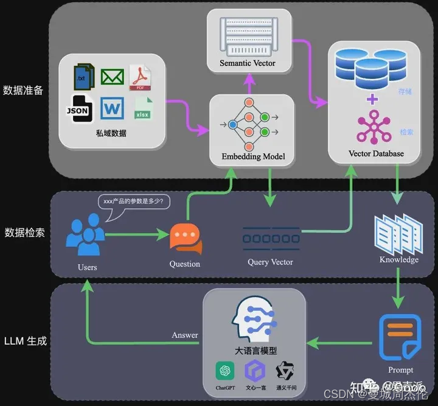

# RAG (Retrieval Augmented Generation)

https://blog.csdn.net/victor_manches/article/details/136493368

## LangChain

LangChain 是一个用于开发由语言模型驱动的应用程序的框架。我们相信，最强大和不同的应用程序不仅将通过 API 调用语言模型，还将：
- 数据感知：将语言模型与其他数据源连接在一起。
- 主动性：允许语言模型与其环境进行交互。