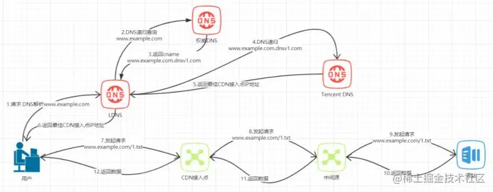

# CDN
> Content Delivery Network，即内容分发网络

CDN是一种内容分发网络，它能够实时地根据网络流量和各节点的连接、负载状况以及到用户的距离和响应时间等综合信息将用户重新导向离用户最近的服务节点上。

其目的是使用户就近获取内容，解决网络拥挤的状况，提高用户访问网站的响应速度。

**加速内容分发，是终端和中心主机之间的缓存，让终端更快的获取数据的同时，减轻了中心的压力**

## CDN和DNS的调度

[图解|什么是内容分发网络(cdn)](https://juejin.cn/post/7064952956201730062?searchId=20250123111930E4384814B0C3212F2CB0)

假如没有CDN，我们访问资源时会使用DNS进行解析获取资源服务器的IP地址进行数据交互。

**用户如何获取CDN资源节点的IP地址呢？**

前半部分和传统模式类似，重要的区别在于**专用DNS调度服务器**的出现，图中为TenCent DNS Server，这台CDN服务商提供的专用DNS调度服务器**根据CDN系统内部节点的位置、负载情况、资源分配等因素选出最优的CDN资源节点IP地址**返回给用户

##  OS对象存储（Object Storage）
- 分布式存储服务，用于存储和管理海量数据对象，包括文件和对象，可以用于存储和管理大量的数据，例如图片、音频、视频等
- 减少大型网站的数据存储成本
- 提高网站的访问速度
- 但没有缓存功能，搭配CDN可以减少大量流量费用，通常不直接面向终端用户

[将项目静态资源上传至对象存储](https://q.shanyue.tech/deploy/oss-rclone)

了解：内容存储网络（Content Storage Network，简称CSN）用户就近写入的数据，可以即时在任何一个CSN的资源池读到数据，这就是CSN内容存储网络和其他的云存储的不同之处

## 面试题

> 为什么利用多个域名来存储网站资源会更有效？
- 突破浏览器并发限制，浏览器一次能发送的http请求是有限的
- 节约主域名的连接数，优化页面响应速度
- 使用多个域名可以将资源分布到不同的CDN节点上，充分利用CDN的分布式优势
- 负载均衡，多个域名可以将请求分散到不同的服务器或服务上，避免单一服务器过载，提高系统的稳定性和可扩展性
- 注意：域名数量不宜过多：过多的域名会增加DNS解析开销，可能抵消性能提升。

