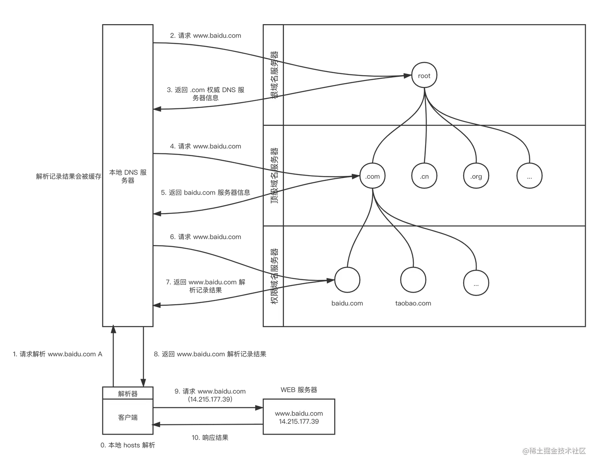

# DNS
DNS（domain name system）域名系统，用来解析域名到IP的映射关系
- 一个由分层的 DNS 服务器实现的**分布式数据库**
- 一个使得主机能够查询分布式数据库的**应用层协议**

## DNS是一个分布式分层数据库

> 分布式

整个 DNS 系统由分散在世界各地的很多台 DNS 服务器组成，每台 DNS 服务器上都保存了一些数据，这些数据可以让我们最终查到主机名对应的 IP。这个世界上没有一台 DNS 服务器拥有因特网上所有主机的映射，每台 DNS 只负责部分映射

> 分层

DNS 服务器有 3 种类型：
- 根 DNS 服务器： 全世界目前有13组域名根节点
- 顶级域（Top-Level Domain, TLD）DNS 服务器，如 `com` `cn`等
- 从域名服务器 DNS 服务器：返回主机 IP 的最终映射

**本地DNS服务器**
- 严格来说，本地 DNS 服务器并不属于 DNS 的层次结构
- 每个 ISP(网络服务供应商) 都有一台本地 DNS 服务器，比如一个居民区的 ISP、一个大学的 ISP、一个机构的 ISP，都有一台或多台本地 DNS 服务器。当主机发出 DNS 请求时，该请求被发往本地 DNS 服务器，本地 DNS 服务器起着**代理**的作用，并负责将该请求转发到 DNS 服务器层次结构中
- 公共DNS是递归DNS的一种特例，它是一种全网开放的递归DNS服务，而传统的递归DNS信息一般由运营商分发给用户
- CDN专用DNS服务器

**转发DNS**
它不提供直接解析域名的服务，它将请求转发给递归DNS，然后将递归DNS的结果转发一下，也提供缓存作用。比如，日常家用的路由器

> 域名解析记录方式

- A记录：A代表Address,用来指定域名对应的ip,例如将www.hello.com指定到 113.112.3.xxx, A记录可以将多个域名解析到一个ip地址，但是不能讲一个域名解析到多个ip地址
  - A记录中直接填写ip仅适合简单应用的单机部署
  - 对于大型分布式应用，ip地址是动态变化的，因此采用动态解析ip的方式（根据网络环境地区等）
  - 这些ip对应的服务器也并非应用服务器，而是具备反向代理能力的负载均衡服务器、web防火墙等
  - 真正的web应用服务器是不会暴露在公网环境的
- CNAME记录：Canonical Name，别名解析。所谓别名解析就是可以为一个域名设置一个或者多个别名，如将aaa.com解析到bbb.net、将ccc.com也解析到bbb.net，其中bbb.net分别是aaa.com和ccc.com的别名
- MIX记录：Mail Exchange，就是可以将某个域名下的邮件服务器指向给自己的Mail Server
- NS记录：为某个域名指定DNS解析服务器，也就是这个域名由指定的IP地址的DNS服务器解析
- TXT记录：为某个主机名或域名设置说明，如可以为ucloud.cn是指TXT记录为“中立安全可信赖”这样的说明

## DNS查询过程

DNS 查询是一个递归 + 迭代的过程
- 从浏览器发起DNS解析请求经过本机、路由器等到达本地DNS服务器，是递归；
- 本地DNS服务器依次请求根域名服务、顶级域名服务器、从域名服务器获取ip是迭代



> [dig工具检查DNS解析过程](https://cloud.tencent.com/developer/article/1569087)


## DNS解析存在的问题

标准 DNS 协议如同大多数早期互联网协议一样，完全没有考虑安全问题，数据是通过明文传输的
- DNS 欺骗/缓存中毒 (DNS Cache Poisoning)：原理是利用 DNS 协议设计时的安全缺陷，通过伪造 ARP 应答包，当 ARP 欺骗成功后，只有嗅探到目标主机发出 DNS 请求包就解析后立即构造一个伪造的 DNS 返回包欺骗目标主机，解析器则会将返回包的结果保存进 DNS 缓存表中，而后当真实的 DNS 返回包到来时则会被丢弃。简单来说就是冒充 DNS 服务器
- DNS 劫持 (DNS Hijacking)：结果和 DNS 缓存一样，都是篡改 DNS 解析结果，只是不单单针对的是解析器中的 DNS 缓存表，而是针对 DNS 解析链路上的每一步。比如
  - 通过木马病毒或恶意软件篡改 DNS 配置 (hosts 文件，DNS 服务器地址，DNS 缓存表等)
  - 利用路由器漏洞篡改路由器的 DNS 配置

## 其它

> DoH, DNS over HTTPS

通过加密的 HTTPS 协议进行 DNS 解析请求，代替标准的，基于 UDP 的 DNS 协议，可以有效避免域名被运 DNS 劫持，DNS 欺骗/缓存中毒等域名安全问题

如：阿里云公共DNS

以及 DoT，DNS over TLS

> 智能DNS(全局负载均衡)

GSLB是Global Server load Blance的缩写，即全局负载均衡。目的是实现互联网上不同地域的服务器间的流量调配，保证使用户的请求能被离用户最近或者服务质量更好的服务器来处理。

> 反向代理水平扩展

典型的互联网架构中，可以通过增加web-server来扩充web层的性能，但反向代理nginx仍是整个系统的唯一入口如果系统吞吐超过nginx的性能极限，那么将难以扩容，此时就需要dns-server来配合水平扩展。

即DNS解析服务器有序的把域名解析到不同的网关层，每次DNS解析请求，轮询返回不同的ip，这样就能实现nginx的水平扩展，这个方法叫 “DNS轮询”

> 通过修改本地hosts方式来给本地项目配置一个伪域名，有效解决本地开发跨域导致cookie无法传输的问题

> DNS预解析
```html
<!--指明浏览器需要提前解析的域名 -->
<link rel="dns-prefetch" href="//cdn.example.com"
```

> nslookup查看实际使用的CDN