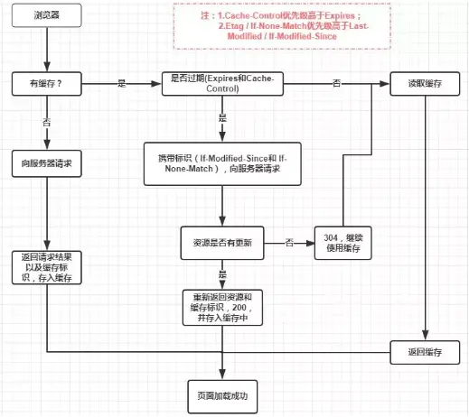

# 浏览器的缓存机制

[深入理解浏览器的缓存机制](https://www.jianshu.com/p/54cc04190252)

##  缓存位置

- Service Worker (了解)

[Service Worker](https://www.bookstack.cn/read/webapi-tutorial/docs-service-worker.md) 首先是一个运行在后台的 Worker 线程，然后它会长期运行，充当一个服务

Service Worker 实现缓存功能一般分为三个步骤：首先需要先注册 Service Worker，然后监听到 install 事件以后就可以缓存需要的文件，那么在下次用户访问的时候就可以通过拦截请求的方式查询是否存在缓存，存在缓存的话就可以直接读取缓存文件，否则就去请求数据。必须使用https协议。

- Memory Cache
**内存中的缓存**，主要包含的是当前中页面中已经抓取到的资源,例如页面上已经下载的样式、脚本、图片等。读取内存中的数据肯定比磁盘快,内存缓存虽然读取高效，可是缓存持续性很短，会随着进程的释放而释放。 一旦我们关闭 Tab 页面，内存中的缓存也就被释放了。

内存缓存中有一块重要的缓存资源是`preloader`相关指令（例如<link rel="prefetch">）下载的资源。总所周知preloader的相关指令已经是页面优化的常见手段之一，它可以一边解析js/css文件，一边网络请求下一个资源。

内存缓存在缓存资源时并不关心返回资源的HTTP缓存头Cache-Control是什么值，同时资源的匹配也并非仅仅是对URL做匹配，还可能会对Content-Type，CORS等其他特征做校验。

- Disk Cache

存储在硬盘中的缓存，读取速度慢点，但是什么都能存储到磁盘中，比之 Memory Cache 胜在容量和存储时效性上。

根据 HTTP Herder 中的字段判断哪些资源需要缓存，哪些资源可以不请求直接使用，哪些资源已经过期需要重新请求。并且即使在跨站点的情况下，相同地址的资源一旦被硬盘缓存下来，就不会再次去请求数据。

- Push Cache (了解)
Push Cache（推送缓存）是 HTTP/2 中的内容，当以上三种缓存都没有命中时，它才会被使用。它只在会话（Session）中存在，一旦会话结束就被释放，并且缓存时间也很短暂，在Chrome浏览器中只有5分钟左右，同时它也并非严格执行HTTP头中的缓存指令

以上四种缓存都没有命中的话，那么只能发起请求来获取资源了

> 浏览器缓存分为强缓存和协商缓存。当客户端请求某个资源时，获取缓存的流程如下

- 当 `ctrl+f5` 强制刷新网页时，直接从服务器加载，跳过强缓存和协商缓存；
- 当 `f5`刷新网页时，跳过强缓存，但是会检查协商缓存；

## 强缓存
> 不会向服务器发送请求，直接从缓存中读取资源, Chrome Dev的Nextwork中的Size显示from disk cache或from memory cache，强缓存可以通过设置两种 HTTP Header 实现：

- `Expires`：缓存过期时间，用来指定资源到期的时间，是服务器端的具体的时间点
  - Expires=max-age + 请求时间，需要和Last-modified结合使用
  - Expires是**服务器响应消息头字段**，在响应http请求时告诉浏览器在过期时间前浏览器可以直接从浏览器缓存取数据，而无需再次请求
  - 是 `http/1.0` 时的规范，值为一个绝对时间的 `GMT` 格式的时间字符串，**受限于本地时间**，如果修改了本地时间，可能会造成缓存失效。
- `Cache-Control:max-age`
  - 该字段是 `http/1.1`的规范，强缓存利用其 `max-age` 值来判断缓存资源的最大生命周期，它的值单位为秒，如300代表5分钟）
  - 可以在请求头或响应头中设置，有多种指令可以配合使用：
    - `max-age`: 强缓存过期时间
    - `s-maxage`: 覆盖max-age，作用一样，只在代理服务器中生效
    - `no-store`：不做任何形式的缓存
    - `no-cache`：缓存，但下次发起请求需要发起验证看是否过期（协商缓存验证，表示不使用 Cache-Control的缓存控制方式做前置验证，而是使用 Etag 或者Last-Modified字段来控制缓存）
    - `public`：表示响应可以被客户端和代理服务器缓存
    - `private`：表示响应只可以被客户端缓存
    - `max-state=30`：30s内，即使缓存过期，也使用该缓存
    - `min-refresh=30`：30s内获取最新的响应

## 协商缓存
> 协商缓存就是强制缓存失效后，浏览器携带缓存标识向服务器发起请求，由服务器根据缓存标识决定是否使用缓存的过程
> 协商缓存可以通过设置两种 HTTP Header 实现：

- `Last-Modified`和`If-Modified-Since`
  - Last-Modified 值为资源最后更新时间，第一次请求资源后**随服务器响应头返回**
    - **问题**：如果本地打开缓存文件，即使没有对文件进行修改，但还是会造成 Last-Modified 被修改，服务端不能命中缓存导致发送相同的资源
    - **问题**：以秒计时，如果在不可感知的时间内修改完成文件，那么服务端会认为资源还是命中了，不会返回正确的资源
  - If-Modified-Since 通过比较两个时间来判断资源在两次请求期间是否有过修改，如果没有修改，则命中协商缓存
- `ETag`和`If-None-Match`
  - Etag 表示资源内容的唯一标识，第一次请求资源后**随服务器响应头返回**
    - 更精确，但效率较低
    - 优先级更高
  - If-None-Match 服务器通过比较请求头部的`If-None-Match`与当前资源的`ETag`是否一致来判断资源是否在两次请求之间有过修改，如果没有修改，则命中协商缓存

**补充**
- Vary: 额外的条件判断是否使用缓存，如cookie

## 缓存读取规则

1. 从service worker缓存中读取 (如果有service worker)
2. 查看memory cache
3. 查看disk cache: 如果强缓存存在且未失效，不请求服务器，状态码200；如果强缓存存在但失效，使用协商缓存，比较后确定是304还是200
4. 发送请求
5. 把响应存入Disk cache （如果响应头信息有相应配置 ）
6. 把相应内容存入memory cache （无视http头配置）
7. 把响应内容存入service worker的cache storage（如果有service worker）
