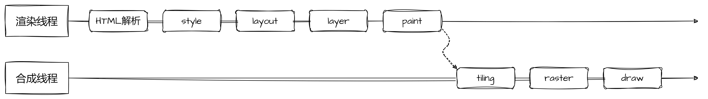

# 页面渲染
> 一次请求会产生哪些缓存？ `dns`缓存，`cdn`缓存，浏览器缓存，服务器缓存

## 从浏览器地址栏输入url到显示页面的步骤

浏览器自动补全协议端口，根据url查找本地缓存
1. [DNS解析](/knowledge-lib/browser/DNS/)获取目标服务器IP地址
2. 发起HTTP请求
    - 打开一个socket与目标IP地址端口，三次握手，建立TCP连接
    - https还会进行TLS握手，建立加密通道
    - 浏览器设置请求头、协议、cookie等发出get请求
    - 服务器接收到请求进行解析，返回结果。
3. 服务端处理返回HTTP响应报文，浏览器接收响应
    - 浏览器根据协议版本，以及Connection字段的约定，决定关闭TCP或保留重用，
    - 浏览器根据响应码决定对响应的处理方式
    - 如果响应头是`text/html`，则对其进行html解析，解码数据（如gzip压缩）
    - 浏览器根据响应头的其它内容完成缓存、cookie的设置
4. 浏览器解析渲染页面
  - 当浏览器的**网络线程**收到HTML文档后，会产生一个**渲染任务**，并将其传递给**渲染主线程的消息队列**。
  - 在**事件循环机制**的作用下，渲染主线程取出消息队列中的渲染任务，开启**渲染流程**
  - 渲染流程分为多个阶段：`HTML解析`、`样式计算`、`布局`、`分层`、`绘制`、`分块`、`光栅化`、`绘画`，每个阶段都有明确的输入输出，上一个阶段的输出会成为下一个阶段的输入，形成一个严密的渲染流水线。

### HTML解析流程
- 解析HTML文档，构建`DOM树`
  - 字节数据 -- 字符串 -- 字符串标记 -- 分析出node节点 -- 构建dom树
  - 预解析线程：为提高效率，率先下载外部css和外部js
- 遇到link，并行下载，解析css，构建`CSSOM树`
  - 不会阻塞DOM解析，但会阻塞script加载，依照HTML5标准，javascript脚本执行前，出现在当前script之前的link必须完全载入
- 遇到script，会阻塞DOM解析，执行js脚本
  - 原因：js中可能会修改DOM, 如果先解析后加载的话，DOM 树还得重新解析 
  - 异步加载script的属性：
    - `defer`：异步加载，等 DOM 解析完之后再运行，在 `DOMContentloaed` 之前，因此其还是会阻塞DOM解析
    - `async`: 异步加载，但等该资源下载完成之后立刻运行，运行时机不定，可能会可能不会阻塞DOM解析
    - [浏览器是如何解析html的？](https://juejin.cn/post/6844903745730396174#heading-1)

### 样式计算

主线程会遍历DOM树，计算每个节点的最终样式`Computed Style`。在这一过程中很多预设值会变成绝对值，比如`red`变成`rgb(255,0,0)`.
**这一步结束后会得到一棵带有样式的DOM树**

### 布局Layout
布局阶段会遍历DOM树，计算每个节点的`几何信息`，例如节点的宽高、位置

###  分层Layer
主线程会使用复杂的策略对整个布局树进行分层，意义在于当某个层改变后，仅对该层进行处理，提升效率。

滚动条、堆叠上下文、transform、opacity等或多或少会影响分层结果，也可以通过will-change更大程度上影响分层结果
   
### 绘制paint
主线程会为每个层单独产生绘制指令集，用于描述这一层的内容该如何绘制

**完成后**，主线程将每个图层的绘制信息提交给`合成线程`，剩余工作将有合成线程完成

### 合成tilling  
合成线程对图层进行分块，将其划分为更多的小区域。分块的工作是多线程同时进行的

### 光栅化rast   
合成线程会将块信息交给`GPU进程`，GPU会开启多个线程快速完成光栅化，并优先处理靠近视口的区域

### 画 draw  
- `合成线程`拿到光栅化结果的位图后，生成一个个**指引quad**信息。
- 指引会标识出每个位图应该画到屏幕哪个位置，以及考虑到旋转、缩放等变形
  - **变形发生在合成线程，与渲染主线程无关，这就是transform效率高的本质**
- 合成线程将指引（渲染帧）交给**GPU**，最终完成屏幕成像

## 面试题
**1. 什么是回流 reflow 和 重绘 repaint  ?**
> reflow的本质是浏览器重新计算layout树
- 当进行了会影响布局树的操作后（如：尺寸、位置、隐藏/状态状态发生改变时），产生重绘回流，重新计算布局树
- **注意**：JS 获取 Layout 属性值（如：`offsetLeft`、`scrollTop`、`getComputedStyle`等）也会引起回流。因为浏览器需要通过回流计算最新值，而修改则是异步的
- 回流必将引起重绘，而重绘不一定会引起回流

> repaint的本质是重新根据分层信息计算绘制指令
- 当渲染树中的元素外观（如：颜色）发生改变，不影响布局时，产生重绘

> 如何避免？
- 需要要对元素进行复杂的操作时，可以先隐藏(`display:"none"`)，操作完成后再显示
- 需要创建多个`DOM`节点时，使用`DocumentFragment`创建完后一次性的加入`document`
- 缓存`Layout`属性值，如：`var left = elem.offsetLeft;` 这样，多次使用 `left` 只产生一次回流
- 批量修改元素样式：`elem.className` 和 `elem.style.cssText` 代替 `elem.style.xxx`
- 使用fragment，批量操作
- 在某些地方使用`el.style.top`直接从dom上读取属性而不是读取几何信息
- 让元素脱离文档流，使用`position:absolute`等，减少回流

**2. 为什么transform效率高  ?**

**transform**只影响渲染流程的最后一个`draw`阶段，不会影响`layout布局`或`paint绘制指令`

而且由于draw阶段位于`合成线程`，所以transform的变化和渲染主线程互不影响

**3. window.onload和DOMContentLoaded有什么区别？**

DOMContentLoaded 事件在 DOM 树构建完成时触发，但不需要等待样式表、图片和子框架等资源加载完成。

window.onload 事件则在页面上所有的资源（包括 DOM、样式表、脚本、图片、Flash 等）都加载完成后触发。