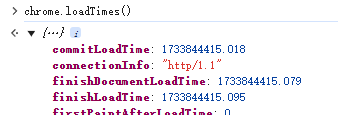
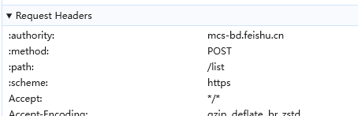
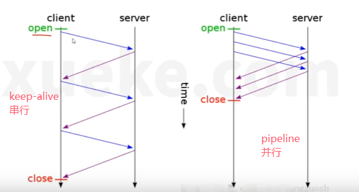
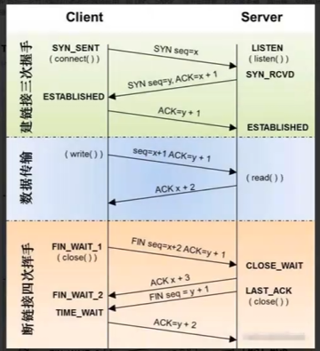
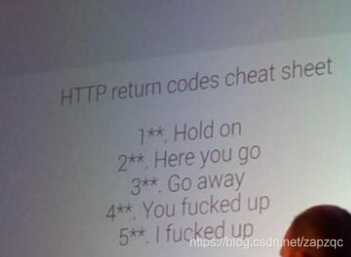

# http


## http1.0
> http0.9 淘汰，仅支持get，没有请求头，无状态，事务结束立即释放

- 新增post  head?
- cookie
- 请求头、状态码

## http1.1
http1.1流控制基于tcp连接。当连接建立时，两端通过系统默认机制建立缓冲区。并通过ack报文来通知对方接收窗口大小，因为http1.1 依靠传输层来避免流溢出，每个tcp连接需要一个独立的流控制机制

- 新增`keep-alive`长连接，默认开启
- 支持请求管道化`pipelining`
- 并发连接：对一个域名分配多个长连接（一定程度缓解了长连接中的`队头堵塞`问题）
- 加入了缓存处理（强缓存和协商缓存）
- 增加了put\delete\options\patch等方法
- 请求头引入range字段，支持断点续传
- 允许数据分块（chunked）,利于大文件传输
- 强制要求host头，`Host`请求头指明了请求将要发送到的服务器主机名和端口号
- 基于文本解析, 头部信息是文本，数据信息文本或者二进制



## http2.0



http2相比于http1.1，性能大幅度提升

- `二进制协议`，头部和内容都是二进制，称为帧`Frame`
- `多路复用`，废弃了pipeline,客户端和服务端可以同时发送多个请求，且不用按照顺序，避免了`队头阻塞`
- 头部压缩
- 服务端主动推送
- 数据流，支持stream

http2允许客户端和服务器端实现他们自己的流控制机制，而不是依赖传输层,两端在传输层交换可用的缓冲区大小，来让他们在多路复用流上设置自己的接收窗口
 
## http3
它基于一个新的传输层协议QUIC，而http3就是建立一个在QUIC上运行的HTTP新规范，而http3之前的版本都是基于TCP，QUIC就是为了替代TCP，解决TCP的一些缺陷
。

- udp
- 彻底解决对头阻塞问题
- 实现平滑迁移

缺点：兼容性不行

> tcp的对头阻塞问题

HTTP/1.1 有队头阻塞，因为它需要完整地发送响应，并且不能多路复用它们
HTTP/2 通过引入“帧”（frames）标识每个资源块属于哪个“流”（stream）来解决这个问题
然而，TCP 不知道这些单独的“流”（streams），只是把所有的东西看作一个大流（1 big stream）
如果一个 TCP 包丢失，所有后续的包都需要等待它的重传，即使它们包含来自不同流的无关联数据。TCP 具有传输层队头阻塞

> QUIC

同样拥有头部压缩，并优化了对乱序发送的支持，也优化了压缩率
放弃tcp，通过`udp`建立，提高了连接建立的速度，降低了延迟
tcp本身是无法解决**队头拥塞[tcp]**（https://zhuanlan.zhihu.com/p/330300133），quic则解决了这个问题

## 什么是长连接keep-alive

TCP每次链接都需要三次握手，四次挥手
在HTTP 1.0中，客户端的每次请求都要求建立一次单独的连接，在处理完本次请求后，就自动释放连接。
在HTTP 1.1中则可以在一次连接中处理多个请求，并且多个请求可以重叠进行，不需要等待一个请求结束后再发送下一个请求,减少了建立和关闭TCP连接的消耗和延迟

## pipeline和keep-alive的区别？和多路复用的区别？



`pipeline`的收必须保证发的顺序，导致`队头阻塞`

`多路复用`基于http2.0的`二进制分帧`，将一次请求的数据分成多个帧，收时不用管顺序和完整，最后http会自己完成数据的组装,解决了`队头阻塞`

## 7层OSI网络结构和4层TCP/IP

> 物理层

使用光纤、网线，传输 0 1 0 1 的比特流，负责最底层的实实在在的物理传输

> 数据链路层

负责准备物理传输，确定Mac地址，将数据按帧（对比特数据的封装）进行传输，如交换机、网卡等

> 网络层

负责分配ip地址，定位设备、决定路由，如家用路由器

> 传输层

使用TCP\UDP协议，为应用程序提供端到端的通信

> 应用层

应用使用如http\ftp等协议进行数据发送，对接收到的数据进行解析

|        OSI 模型        | TCP/IP |             主要协议              |  单位  |
| :--------------------: |:------:| :-------------------------------: | :----: |
|  应用层 (Application)  |  应用层   |   Telnet、FTP、**HTTP**、SNMP等   | 数据流 |
| 表示层 (Presentation)  |   -    | **CSS** GIF **HTML JSON **XML GIF | 数据流 |
|    会话层 (Session)    |   -    |      FTP SSH TLS HTTP(S) SQL      | 数据流 |
|   传输层 (Transport)   |  传输层   |            **TCP UDP**            | 数据段 |
|    网络层 (Network)    |  网际层   |        IP(IPV4、IPV6) ICMP        | 数据包 |
| 数据链路层 (Data Link) | 网络接口层  |      802.2、802.3ATM、HDLC、      |   帧   |
|   物理层 (Physical)    |   -    |         V.35、EIA/TIA-232         | 比特流 |

|   结构名   | 功能                                                         |              主要设备               |
| :--------: | :----------------------------------------------------------- | :---------------------------------: |
|   应用层   | 确定通信对象，提供访问网络服务的接口                         |                网关                 |
|   表示层   | 负责数据的编码、转化（界面与二进制数据转换，高级语言与机器语言的转换）数据压缩、解压，加密、解密。根据不同应用目的处理为不同的格式，表现出来就是我们看到的各种各样的文件扩展名。 |                网关                 |
|   会话层   | 负责建立、维护、控制会话单工(Simplex)、半双工(Half duplex)、全双工(Full duplex)三种通信模式的服务 |                网关                 |
|   传输层   | 负责分割、组合数据，实现端到端的逻辑连接三次握手(Three-way handshake)，面向连接(Connection-Oriented)或非面向连接(Connectionless-Oriented)的服务，流控(Flow control)等都发生在这一层。是第一个端到端，即主机到主机的层次。 |                网关                 |
|   网络层   | 负责管理网络地址，定位设备，决定路由                         |         路由器，网桥路由器          |
| 数据链路层 | 负责准备物理传输，CRC校验，错误通知，网络拓扑，流控等        |         交换机、网桥、网卡          |
|   物理层   | 就是实实在在的物理链路，负责将数据以比特流的方式发送、接收   | 集线器、中继器,电缆，发送器，接收器 |


## TCP和UDP的区别

- 连接性：TCP是面向连接的，可靠；UDP无连接，尽最大努力交付数据，不可靠
- 效率：UDP实时性更好，因为不需要建立连接，更不需要复杂的握手挥手以及复杂的算法，也没有重传机制
- TCP是一对一的，UDP支持一对一、一对多、多对多
- 首部大小：UDP的首部开销（8字节）小于TCP（20字节）
- TCP使用一连串的无结构字节流传输；UDP是一次交付一个完整的报文，报文不可分割，是UDP处理的最小单位；

## TCP的三次握手与四次挥手



> 打开一个socket与目标IP地址端口**建立TCP连接**，三次握手：
  * 客户端发送一个TCP的`SYN, seq=X`的包至服务器端口 (客户端进入SYN_SENT状态，其中X为随机数)
  * 服务端发回`SYN, seq=Y ACK=X+1, `的响应包 (将浏览器发来的X+1，服务端由listen状态变为SYN_RCVD)
  * 客户端发送`ACK=Y+1` (客户端收到服务端响应进入连接确定状态，将服务端发送的随机数Y+1返回，服务端在收到后同样进入连接确定状态)

> 关闭的四次握手：
  * 客户端发送`Fin, seq=X+2 ACK=y+1`报文 (客户端发送关闭信号，携带在建立连接时的X+2 Y+1, 进入结束连接等待状态1，FIN_WAIT_1)
  * 服务端发送`Ack=X+3` (服务端收到后响应X+3，进入关闭等待状态CLOSE_WAIT, 开始处理连接断开的清理操作, 客户端在收到该响应后进入FIN_WAIT_2) 
  * 服务端发送`Fin, Seq=Y+1` (服务端在准备好后，发送FIN信号，进入等待最终响应的状态)
  * 客户端发送`Ack=Y+2` （客户端发送最终响应）

- 如果服务端始终没有收到客户端的最终响应会超时重传FIN，收到后才会释放TCO占用的资源和端口；
- 而客户端在发送最终响应后会等待2MSL(最大存活时间)，防止服务端未收到重新发送FIN，之后才会释放自己的TCP资源

## 状态码



* `1xx`：临时响应，表示服务器正在处理请求的一个状态；
  * `100 Continue`继续，一般在发送`post`请求时，已发送`http header`之后服务端将返回此信息，表示确认，之后再发送具体参数信息
* `2xx`：成功状态码，表示请求已完成，服务器向浏览器提供了预期的响应；
  * `200 Ok`请求成功，正常返回信息
  * `201 Create`请求成功并在服务器创建了新的资源
* `3xx`：重定向，表示你的请求被重定向到了其他地方，服务器收到了请求但是有某种重定向；
  * `302 Found`临时重定向。但资源只是临时被移动。客户端应继续使用原有 URI
  * `304 Not Modified`未修改，`协商缓存`。所请求的资源未修改，服务器返回此状态码时，不会返回 任何资源。客户端通常会缓存访问过的资源，通过提供一个头信息指出客户端希望只返 回在指定日期之后修改的资源
* `4xx`：客服端请求错误，表示客服端发生错误导致服务器无法处理请求；
  * `400 Bad Request` 客户端请求的语法错误，服务器无法理解
  * `401 Unauthorized`请求要求用户的身份认证
  * `403 Forbidden`禁止访问，用户认证后，但权限不足，无法对该资源进行操作
  * `404 Not Found` 找不到与url相匹配的资源。通过此代码，网站 设计人员可设置"您所请求的资源无法找到"的个性页面。
* `5xx`：服务端错误，客服端发出有效请求，但是服务器未做出正确处理请求

## TCP中的滑动窗口和拥塞控制

都是用来解决网络传输中的拥堵问题

> 滑动窗口：

主要是TCP自身的一种流量控制技术，通过一些机制来让发送方知道接收方还有多大的缓存，从而让发送方通过`滑动窗口`动态的决定要发送多大的数据，防止数据过多导致网络堵塞，掉包。

> 拥塞控制：

防止过多的网络数据在网络链路中同时传出，导致链路、路由器等过载，造成堵车的现象。TCP发送方通过维持一个`拥塞窗口`动态的控制发送数据的速率。

一般，发送方应该使用`滑动窗口`和`拥塞窗口`中较小的一个

## https加密

**内部的加密协议**


- 客户端发起 HTTPS 请求 用户在浏览器里输入一个 https 网址，然后连接到 server 的 443 端口，告诉浏览器自己支持的hash算法

- 服务端(采用 HTTPS 协议的服务器必须要有一套数字证书，这套证书其实就是一对公钥和私钥), 传送证书(这个证书其实就是公钥，只是包含了很多信息，如证书的颁发机构，过期时间等等。)

- 客户端解析、验证证书

浏览器验证公钥是否有效，比如颁发机构，过期时间等等，如果发现异常，则会弹出一个警告框，提示证书存在问题。

- 传送加密信息

如果证书没有问题，那么就生成一个随机值（未来作为对称加密的公钥），然后用证书（公钥）对该随机值进行加密，并传送

- 服务端解密信息，进行对称加密传输

服务端用私钥解密后，得到了客户端传过来的随机值(对称秘钥)，然后把需要传输的内容通过该值进行对称加密

> TLS/SSL的功能实现主要依赖于三类基本算法：
- 利用非对称加密实现身份认证和密钥协商;
- 对称加密算法采用协商的密钥对数据加密
- 基于散列函数验证信息的完整性。

1、对称加密中加密和解密使用的秘钥是同一个；非对称加密中采用两个密钥，一般使用公钥进行加密，私钥进行解密。
2、对称加密解密的速度比较快，非对称加密和解密花费的时间长、速度相对较慢。
3、对称加密的安全性相对较低，非对称加密的安全性较高。

> http和https的区别是什么呢？

- HTTPS和HTTP都是数据传输的应用层协议，区别在于HTTPS比HTTP安全
- HTTP 明文传输，数据都是未加密的，安全性较差; HTTPS（SSL+HTTP） 数据传输过程是加密的，安全性较好。使用 HTTPS 协议需要到 CA（Certificate Authority，数字证书认证机构） 申请证书，一般免费证书较少，因而需要一定费用。
- http 和 https 端口也不一样，前者是 80，后者是 443。
- 初始时HTTP 页面响应速度比 HTTPS 快，主要是因为 HTTP 使用 TCP 三次握手建立连接，客户端和服务器需要交换 3 个包，而 HTTPS除了 TCP 的三个包，还要加上 ssl 握手需要的 9 个包，所以一共是 12 个包, HTTPS 比 HTTP 要更耗费服务器资源

> https绝对安全吗？

不，小心`中间人攻击`，其对浏览器冒充服务端，对服务端冒充浏览器

对程序员来说没什么能做的：
- 不要轻易信任证书，不要访问不知名网站
- 注意浏览器的安全提示
- 不要随意连接公共wifi

## 浏览器缓存


必看： https://www.jianshu.com/p/54cc04190252

<iframe src="https://www.jianshu.com/p/54cc04190252" style="width: 100%;
height: 600px;"  />


## 什么时websocket

websocket来自html5，是一个新的协议，与http基本没关系，最大的特点是连接建立后服务端可以主动向客户端发送消息，属于服务端推送技术的一种，实现了全双工通信

- 建立在TCP协议之上，高效，可以发送文本或二进制数据
- 与http有良好的兼容性，默认端口也是80和443，并且握手阶段采用http协议，不易被屏蔽
- 没有同源限制，客户端可以和任意服务器通信
- 协议标识符为`ws`，如果加密则为`wss`,服务器网址就是url


> 有哪些服务端推送技术？

SSE, EventSource 是 HTML5 中 Server-sent Events 规范的一种技术实现。EventSource 接口用于接收服务器发送的事件。它通过 HTTP 连接到一个服务器，以 text/event- stream 格式接收事件, 不关闭连接。通过 EventSource 服务端可以主动给客户端发现 消息，使用的是 HTTP 协议，单项通信，只能服务器向浏览器发送； 与 WebSocket 相比轻量，使用简单，支持断线重连

> Socket和websocket是什么关系？

没有关系，就像java和javascript
socket是tcp/ip协议的封装和应用，如node中的socket模块

## 几种请求方法用途

HTTP（HyperText Transfer Protocol，超文本传输协议）中定义的请求方法共八种：

* `GET`发送一个请求取得服务器上的某一资源，检索信息（查）
    * 能被浏览器缓存，被书签收藏
    * 请求参数放在URL中，以`?`分割URL和数据，参数之间用`&`分割，数据是英文字母或数字时原样发送；是空格时转换为`+`；是中文时转换为base64编码，长度有限制.(浏览器会尝试解析，就需要分配内存)
    * 回退是无害的
    * GET /url HTTP/1.1 \r\n
* `POST`向URL指定的资源提交数据或附加新的数据，即创建或附加资源（增、改）
    * 很少能被缓存，不能被书签收藏
    * 参数放在请求体中message body，长度没有限制
    * 回退会再次提交请求
    * POST /url HTTP/1.1 \r\n
* `PUT`和`post`很像，也向服务器提交数据，不同在于`put`指定了资源在服务器上的位置，创建或替换资源（增、改）
    * 华为手机浏览器不支持PUT方法，因此有些公司会规定添加和修改都使用POST
    * 不可缓存
* `DELETE`删除服务器上的某资源（删）。
* `HEAD`只请求与`get`请求一致的页面的头部，检查一个大文件是否存在，检查文件是否有新版本。
* `OPTIONS`用于获取当前URL所支持的方法，成功会有一个`Allow`的头包含支持的方法；也可以利用其向 web 服务器发送 `*` 的请求来测试服务器的功能性
* `TRACE`回显服务器收到的请求，主要用于测试或诊断
* `CONNECT` HTTP/1.1协议中能够将连接改为管道方式的代理服务器

> GET和POST的区别
- GET在浏览器回退时是无害的，而POST会再次提交请求。
- GET产生的URL地址可以被Bookmark，而POST不可以。
- GET请求会被浏览器主动cache，而POST不会，除非手动设置。
- GET请求只能进行url编码，而POST支持多种编码方式。
- GET请求参数会被完整保留在浏览器历史记录里，而POST中的参数不- 会被保留。
- GET请求在URL中传送的参数是有长度限制的，而POST么有。
- 对参数的数据类型，GET只接受ASCII字符，而POST没有限制。
- GET比POST更不安全，因为参数直接暴露在URL上，所以不能用来传- 递敏感信息。
- GET参数通过URL传递，POST放在Request body中。

*补充*：

* HTTP协议中的概念：“安全”：读操作，“幂等”：多次执行与执行一次效果相同

* GET请求能够被保存在浏览器的浏览历史里面
  不准确！只有是在浏览器地址栏内输入的URL地址才可以在浏览器历史中查看。

* GET参数是带在URL后面，传统IE中URL的最大可用长度为2048字符，其他浏览器对URL长度限制实现上有所不同，POST请求无长度限制
  不准确！上方已经写出了结论：除了在地址栏中输入URL发送GET请求有明显的限制，而直接通过代码发送请求，Get(80K左右)和Post(100K)发送的数据大小相差不多。


## 报文request和response的结构

### request报文结构

```text
（1）请求行：请求方法 请求url 协议版本 CRLF(换行符)
GET /Protocols/rfc2616/rfc2616-sec5.html HTTP/1.1
（2）请求头：包含若干行内容，每行以CRLF结束
Host: www.w3.org
Connection: keep-alive
Cache-Control: max-age=0
Accept: text/html,application/xhtml+xml,application/xml;q=0.9,image/webp,*/*;q=0.8
User-Agent: Mozilla/5.0 (Windows NT 6.1; WOW64) AppleWebKit/537.36 (KHTML, like Gecko) Chrome/35.0.1916.153 Safari/537.36
Referer: https://www.google.com.hk/
Accept-Encoding: gzip,deflate,sdch
Accept-Language: zh-CN,zh;q=0.8,en;q=0.6
Cookie: authorstyle=yes
If-None-Match: "2cc8-3e3073913b100"
If-Modified-Since: Wed, 01 Sep 2004 13:24:52 GMT
（3）空行 CRLF
（4）请求体：
name=qiu&age=25
```

### response报文结构

```text
（1）响应状态行：协议版本 状态码 状态描述 CRLF
HTTP/1.1 200 OK
（2）响应头：若干响应头，包括通用头部、响应头部、实体头部
Date: Tue, 08 Jul 2014 05:28:43 GMT
Server: Apache/2
Last-Modified: Wed, 01 Sep 2004 13:24:52 GMT
ETag: "40d7-3e3073913b100"
Accept-Ranges: bytes
Content-Length: 16599
Cache-Control: max-age=21600
Expires: Tue, 08 Jul 2014 11:28:43 GMT
P3P: policyref="http://www.w3.org/2001/05/P3P/p3p.xml"
Content-Type: text/html; charset=iso-8859-1
（3）空行 CRLF
（4）响应体：
{"name": "qiu", "age": 25}
```

## # 几种重要的content-type 的应用

参考：https://juejin.cn/post/6966874464323633183

Content-type在请求头、响应头中都存在，在请求头中的它的作用是告知服务器请求参数的数据类型（MIME类型），服务器可以用合适的方法去处理它。在响应头中的作用是告知浏览器此次响应内容的数据类型，客户端可以用合适的方法去处理它。

**multipart/form-data**

这种类型一般用在上传二进制文件，比如上传图片或者上传文件等，也可用于包含文件的表单提交。

**application/json**

一般都用于响应头，但是现在也普遍用于请求头，用于告诉服务器消息主体是序列化后的JSON字符串。

**application/x-www-form-urlencoded**

表单默认的提交数据的格式，数据被格式化为key:value的形式，并进行编码。

**text/html**

将文件的content-type设置为text/html的形式，浏览器在获取到这种文件时会自动调用html的解析器对文件进行相应的处理。

**text/plain**

将文件设置为纯文本的形式，浏览器在获取到这种文件时并不会对其进行处理。

## 一句话概括RESTFUL

[题目](https://www.nowcoder.com/questionTerminal/6e5324efec41442ca7c7b94b129c5485#:~:text=%20RESTful%E6%98%AF%E7%9B%AE%E5%89%8D%E6%AF%94%E8%BE%83%E6%B5%81%E8%A1%8C%E7%9A%84%E4%B8%80%E7%A7%8D%E4%BA%92%E8%81%94%E7%BD%91%E6%9E%B6%E6%9E%84%EF%BC%8C%E5%AE%83%E7%9A%84%E4%BD%9C%E7%94%A8%E4%B8%BB%E8%A6%81%E6%98%AF%E5%AF%B9%E8%AF%B7%E6%B1%82%E8%B5%84%E6%BA%90%E6%97%B6%EF%BC%8C%E6%89%80%E4%BD%BF%E7%94%A8%E7%9A%84URI%E7%9A%84%E7%BB%93%E6%9E%84%E5%81%9A%E4%B8%80%E4%B8%AA%E8%A7%84%E5%AE%9A%E3%80%82%20RESTful,%E6%98%AF%E4%B8%80%E7%A7%8D%E4%BA%92%E8%81%94%E7%BD%91%E8%BD%AF%E4%BB%B6%E6%9E%B6%E6%9E%84%EF%BC%8C%E6%98%AF%E5%BA%94%E7%94%A8%E7%A8%8B%E5%BA%8F%E7%9A%84%E6%8E%A5%E5%8F%A3%E3%80%82%20%E6%8B%A5%E6%9C%89%E8%A1%A8%E7%A4%BA%E5%9F%9F%E5%90%8D%E5%92%8Capi%EF%BC%8C%E7%94%A8UPI%E8%A1%A8%E7%A4%BA%E8%B5%84%E6%BA%90%EF%BC%8C%E7%94%A8HTTP%20method%E6%8F%8F%E8%BF%B0%E5%AF%B9%E8%B5%84%E6%BA%90%E7%9A%84%E5%A2%9E%E5%88%A0%E6%94%B9%E6%9F%A5%EF%BC%8C%E6%8B%A5%E6%9C%89%E8%BF%87%E6%BB%A4%E4%BF%A1%E6%81%AF%E7%9A%84%E5%8F%82%E6%95%B0%E3%80%82)
