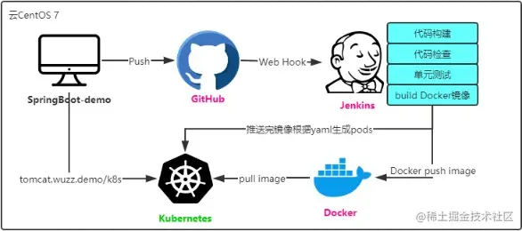

# k8s

Docker 是用于构建、分发、运行（Build, Ship and Run）容器的平台和工具。

而 k8s 实际上是一个使用 Docker 容器进行编排的系统，主要围绕 pods 进行工作。**Pods 是 k8s 生态中最小的调度单位，可以包含一个或多个容器。**

Docker 和 k8s 是根本上不同的技术，两者可以很好的协同工作。

k8s 由众多组件组成，组件间通过 API 互相通信，归纳起来主要分为三个部分：
- controller plant 控制平面，用于调度程序以及节点状态检测

控制平面组件会为集群做出全局决策，比如资源的调度、检测以及响应集群事件等。控制平面组件可以在集群中的任何节点上运行。 然而，为了简单起见，设置脚本通常会在同一个计算机上启动所有控制平面组件， 并且不会在此计算机上运行用户容器

- nodes 构成了 Kubernetes 集群的集体计算能力，实际部署容器运行的地方

Node（节点）可以理解为机器节点，可以是虚拟机或者一台真实的物理机器。通常一个集群中会有若干节点，如果是资源受限的环境中，集群也可能只有一个节点。

- pods Kubernetes 集群中资源的最小单位

Pod 是可以在k8s中创建和管理的、最小的可部署的计算单元，一个 Node 可以有一个或者多个 Pod。其英文大意是豆荚，如果把容器比作豌豆，那么Pod就是豌豆荚，即Pod是由一组容器（一个或者多个）组成，这些容器共享存储、网络、以及怎样运行这些容器的声明。

**Kubernetes 集成 Jenkins 实现 CICD**

**GitLab + Jenkins Pipeline + Doker + k8s + Helm 自动化部署**

>  k8s 与 Docker Swarm

Swarm 是 Docker 亲儿子，但依旧没有 k8s 流行，不流行很大程度是因为商业、生态的原因
