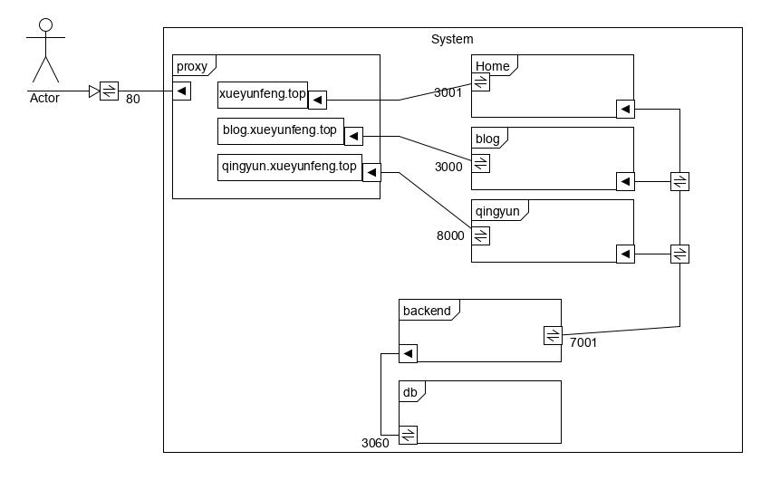
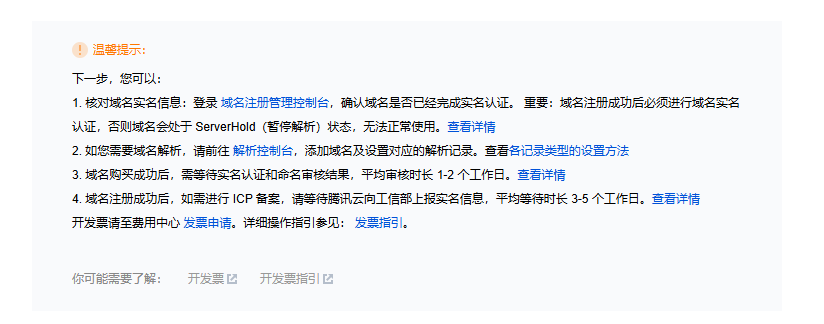

# 建站
> 云服务商如腾讯云的指引都很清晰，跟着走就没大问题

1. 购买服务器

在服务器上部署项目，先使用ip直接访问没问题


```docker-compose.yml
services:
    backend:
        container_name: backend_server
        build: ./backend
        image: backend:$BACKEND_COMMIT
        ports:
            - 7001:7001
        restart: always
    frontend:
        container_name: frontend_server
        build: ./frontend
        image: frontend:$FRONTEND_COMMIT
        ports:
            - 80:80
        restart: always
        depends_on:
            - backend
```

2. 购买域名

在云服务商处购买域名



3. 备案
4. DNS域名解析：将域名指向我们的服务器

