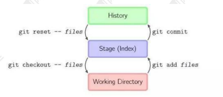
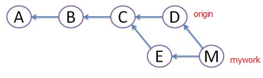
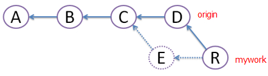

# Git

## 初始提交
```shell
# …or create a new repository on the command line
echo "# xrepo" >> README.md
git init
git add README.md
git commit -m "first commit"
git branch -M main
git remote add origin https://github.com/xpinus/xrepo.git
git push -u origin main

# …or push an existing repository from the command line
git remote add origin https://github.com/xpinus/xrepo.git
git branch -M main
git push -u origin main
```

## tag
- 列出标签
```shell
git tag # 在控制台打印出当前仓库的所有标签
```
- 搜索标签
```shell
git tag -l ‘v0.1.*’ # 搜索符合模式的标签
```
- 推送标签到远程仓库
> git push并不会把tag标签传送到远端服务器上，只有通过显式命令才能分享标签到远端仓库
```shell
# push单个tag
git push origin v1.0 #将本地v1.0的tag推送到远端服务器

# push所有tag
git push [origin] --tags
```

## git 提交，文件名大小写的修改提交不上去

https://blog.csdn.net/weixin_44137575/article/details/112801991


## git错误`fatal: unable to access`
1. 检查网络连接
2. 检查代理设置
```shell
git config --global http.proxy
git config --global https.proxy

# 如果代理设置不正确，你可以使用以下命令设置正确的代理（以HTTP代理为例）：
git config --global http.proxy http://127.0.0.1:7890
git config --global https.proxy https://127.0.0.1:7890
# 如果你不需要使用代理，可以使用以下命令取消代理设置：
git config --global --unset http.proxy
git config --global --unset https.proxy

# https://developer.baidu.com/article/details/3291153
```

## git回滚操作

|命令|特点|应用|
|---|---|---|
|`git revert commit`|保留工作区、保留历史提交记录、安全性高 | 可用于撤销产品暂时不想要的功能,并且想要保留之后的提交的功能、生产环境中因新增内容产生严重bug时,也可以用此功能来进行稳定回滚|
|`git reset --hard commit`|清空工作、暂存区、删除历史提交记、稳定性低|可用于删除掉一些低效提交的代码,净化提交记录、因为会清空提交记录,这里不太建议使用(最好不要过度依赖reflog|
|`git checkout coomit -b <new_branch>`|保留工作区、暂存区、保留历史提交记录、安摘取功能点、新分支、新分支中无污染(只保留摘取功能点之前的提交记录)、安全性高|可以用于摘取功能点,如产品说要上新需求时,单独上某一个需求,但是当前分支已经提交了很多功能点,此时我们就可以用该命令单独拎出产品需要的功能进行单独发布|


## rebase 与 merge 的区别?

git rebase 和 git merge 一样都是用于从一个分支获取并且合并到当前分支. 

假设一个场景,就是我们开发的[feature/todo]分支要合并到 master 主分支,那么用 rebase 或者 merge 有什么不同呢?

marge 特点：自动创建一个新的 commit 如果合并的时候遇到冲突，仅需要修改 后重新 commit
- 优点：记录了真实的 commit 情况，包括每个分支的详情 
- 缺点：因为每次 merge 会自动产生一个 merge commit，所以在使用一些 git 的 GUI tools，特别是 commit 比较频繁时，看到分支很杂乱。

rebase 特点：会合并之前的 commit 历史
- 优点：得到更简洁的项目历史，去掉了 merge commit 
- 缺点：如果合并出现代码问题不容易定位，因为 re-write 了 history
  
因此,当需要保留详细的合并信息的时候建议使用 git merge，特别是需要将分支合并 进入 master 分支时；当发现自己修改某个功能时，频繁进行了 git commit 提交时， 发现其实过多的提交信息没有必要时，可以尝试 git rebase

## git reset、git revert 和 git checkout 有什么区别

这个问题同样也需要先了解 git 仓库的三个组成部分：工作区（Working Directory）、 暂存区（Stage）和历史记录区（History）。 
- 工作区：在 git 管理下的正常目录都算是工作区，我们平时的编辑工 作都是在工作区完成 
- 暂存区：临时区域。里面存放将要提交文件的快照 
- 历史记录区：git commit 后的记录区三个区的转换关系以及转换所 使用的命令：



git reset、git revert 和 git checkout 的共同点：用来撤销代码仓库中的某些更改。
不同点：
- 从 commit 层面来说：
  - git reset 可以将一个分支的末端指向之前的一个 commit。然后再 下次 git 执行垃圾回收的时候，会把这个 commit 之后的 commit 都扔掉。
  - git checkout 可以将 HEAD 移到一个新的分支，并更新工作目录。因为可能会覆盖本地的修改，所以执行这个指令之前，你需 要 stash 或者 commit 暂存区和工作区的更改。
  - git revert 和 git reset 的目的是一样的，但是做法不同，它会以创 建新的 commit 的方式来撤销 commit，这样能保留之前的 commit 历史，比较安全。另外，同样因为可能会覆盖本地的修改，所以执行 这个指令之前， 你需要 stash 或者 commit 暂存区和工作区的更改。
- 从文件层面来说：
  - git reset 只是把文件从历史记录区拿到暂存区，不影响工作区的内容
  - git checkout 则是把文件从历史记录拿到工作区，不影响暂存区的内容
  - git revert 不支持文件层面的操作

## git pull和git pull --rebase的使用

当多人开发时，遇到别人先提交，你再提交导致冲突的情况

用git pull命令把"origin"分支上的修改pull下来与本地提交合并（merge）成版本M，但这样会形成图中的菱形，让人很困惑


git rebase


## 清除Git本地已删除远程文件夹

```shell
git fetch --prune  # 确保本地仓库与远程同步
git pull
git clean -fd 
# -f：强制删除未跟踪的文件。
# -d：同时删除未跟踪的文件夹。
```