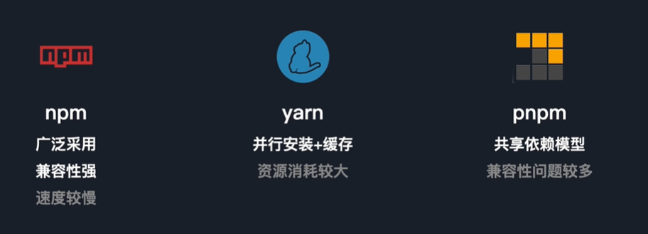

# 包管理工具



- 包管理器有哪些组成部分
## npm的底层环境是什么
> node package manager

网站、注册表（每个表的信息）、命令行工具

## 换源

- 查看源
```shell
npm get registry
yarn config get registry
pnpm get registry 
```
- 临时修改
```shell
npm  install any-touch --registry https://registry.npmmirror.com
yarn add any-touch@latest --registry=https://registry.npmmirror.com
pnpm  install any-touch  --registry https://registry.npmmirror.com
```
- 持久修改
```shell
npm config set registry https://registry.npmmirror.com
yarn config set registry https://registry.npmmirror.com
pnpm config set registry https://registry.npmmirror.com
```
- 还原
```shell
npm config set registry https://registry.npmmirror.com
yarn config set registry https://registry.npmmirror.com
pnpm config set registry https://registry.npmmirror.com
```
- 源管理工具
  - nrm
  - yrm

## [Corepack](https://nodejs.cn/api/corepack.html)

> Corepack 是一个实验性工具，可帮助管理包管理器的版本
> Corepack 是随 Node.js 的默认安装一起分发的，但由 Corepack 管理的包管理器并不是 Node.js 分发版的一部分

启用
```shell
corepack enable
```

换源
`COREPACK_NPM_REGISTRY` sets the registry base url used when retrieving package managers from npm. Default value is `https://registry.npmjs.org`


**verdaccio**用于创建私有npm仓库