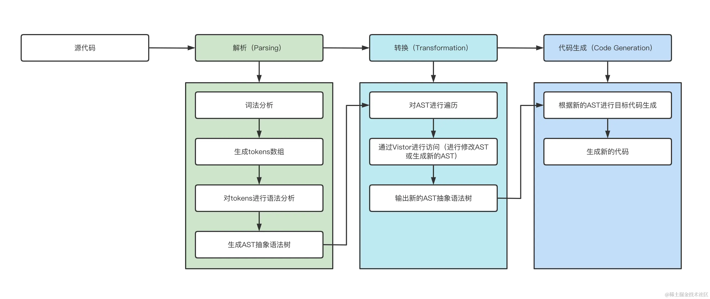

# AST抽象语法树
> 抽象语法树（Abstract Syntax Tree，AST）是源代码语法结构的一种抽象表示，它以树状的形式表现编程语言的语法结构，树上的每个节点都表示源代码中的一种结构。在代码语法的检查、代码风格的检查、代码的格式化、代码的高亮、代码错误提示、代码自动补全等等场景均有广泛的应用。
[在线AST尝试](https://astexplorer.net/)


## 编译器设计篇

> ![TIP]
> 形而上学的理解下概念

一个完整的编译器整体执行过程可以分为三个步骤：
- Parsing(解析过程)：这个过程要经词法分析、语法分析、构建AST（抽象语法树）一系列操作；
- Transformation（转化过程）：这个过程就是将上一步解析后的内容，按照编译器指定的规则进行处理，形成一个新的表现形式；
- Code Generation（代码生成）：将上一步处理好的内容转化为新的代码；



### Parsing 解析
> 解析过程分为2个步骤：词法分析、语法分析。

- 词法分析 (拆分)
  - 词法分析是使用tokenizer(分词器)或者lexer(词法分析器)，将源码拆分成tokens， 
  - tokens是一个放置对象的数组，其中的每一个对象都可以看做是一个单元（数字，标签，标点，操作符...）的描述信息。
- 语法分析 (重组)
  - 将tokens重新整理成语法相互关联的表达形式 ，这种表达形式一般被称为AST（抽象语法树）

### Transforming 转化
> 这个过程主要是改写AST（抽象语法树），或者根据当前AST（抽象语法树）生成一个新的AST（抽象语法树），这个过程可以是相同语言，或者可以直接将AST（抽象语法树）翻译为其他语言

这个创建的过程就需要遍历这个“树”的节点并读取其内容，由此引出 Traversal(遍历) 和 Visitors (访问器)
- Traversal(遍历)：顾名思义这个过程就是，遍历这个AST（抽象语法树）的所有节点，这个过程使用 深度优先原则，大概执行顺序如下：
- Visitors (访问器)：访问器最基本的思想是创建一个“访问器”对象，这个对象可以处理不同类型的节点函数,如下所示
    - 在遍历节点的时候，当 enter (进入)到该节点，我们会调用访问器，然后会调用针对于这个节点的相关函数，同时这个节点和其父节点作为参数传入。
    - 同时在exit（离开）的时候我们也希望能够调用访问器，当 enter 一个节点的时候，最外层节点就相当于一个分支，他是一个节点，这个分支的内部依然存在若干节点，就像上边遍历的那样
    - 我们会按照深度优先的原则，依次遍历到这个分支的最内层，当达到最内层的时候，针对当前分支的访问就完成了，接着会依次exit（退出）节点，这个过程是由内向外的。

### Code Generation 生成代码

将生成的新AST树再转回代码的过程

## 广泛引用

- babel: 一个最常用的Javascript编译器，它能够转译 ECMAScript 2015+ 的代码，使它在旧的浏览器或者环境中也能够运行
  - `@babel/parser`可以把源码转换成AST
  - `@babel/traverse`用于对 AST 的遍历，维护了整棵树的状态，并且负责替换、移除和添加节点
  - `@babel/generate`可以把AST生成源码，同时生成sourcemap
  - `@babel/types`用于 AST 节点的 Lodash 式工具库, 它包含了构造、验证以及变换 AST 节点的方法，对编写处理 AST 逻辑非常有用
  - `@babel/core` Babel 的编译器，核心 API 都在这里面，比如常见的 transform、parse，并实现了插件功能

- eslint
- 代码压缩、混淆
- 按需加载
- typescript类型校验

## 相关面试题

AST（抽象语法树） 到底是什么？
AST基础：从零到一手撸一个功能完备的编译器
AST基础：Babel 的设计理念
AST的应用：手写console插件，再也不怕打开控制台满屏的console了😭😭😭
AST的应用： ES6 是如何转成 ES5 的？
AST的应用：30行代码依靠 AST 实现代码压缩
AST的应用：40行代码知晓 ESLint 的工作原理
AST的应用：手写 按需加载插件 ，同事看了都说666
AST的应用：手写 Typescript 代码检测插件（fork-ts-checker-webpack-plugin），原来 TS语法检测如此简单
其他延伸：结合 AST 手写监控系统中的日志上传插件
其他延伸：教你玩转AST，最佳实践

## Q1:AST是什么？如何得到AST?

一段代码在被执行之前，都会经历三个阶段：
- 1.扫描--词法分析

这个过程会将由字符组成的字符串分解成有意义的代码块，称为词法单元tokens。
例如 var a = 4;会被分解成‘var’,'a','=','4',';'
在词法分析时，一个关键字是一个token，一个标识符也是一个token，一个操作符、标点符号也是一个token，它会忽略空格和换行符、注释等。
最后，整个代码被分解装进一个token数组。
```js
var a = 42;
var b = 5;
function addA(d) {
   return a + d;
}
var c = addA(2) + b;
```


- 2.解析--语法分析

这个过程会将词法单元流转换成一个由元素相互嵌套的、表示程序的语法结构的树，叫做抽象语法树（AST）。同时会检测语法是否错误，如果有错误，就会抛出语法错误，导致整个js文件终止加载。如果没有错误，就会进入预编译阶段。
我们使用的 Webpack 打包工具中 babel 用的解析器是 Acorn。
在生成树的时候，AST会删除掉一些没有用的字符，比如不完整的括号等。因此AST不是与源码100%匹配的。


- 3.预编译

js通过语法分析阶段之后，就会进入预编译阶段，函数声明提升和变量声明就发生在这个阶段。树上的每一个节点表示源代码中的一种结构，之所以说他是抽象的，是因为他不会表示代码中的每一个细节，比如说，嵌套括号被隐含在树的结构中，并没有以节点的形式呈现。抽象语法树并不依赖于源语言的语法。

## Q2：AST用处是什么？

- babel转码

babel是一个javascript编译器。它分为三个阶段运行代码：解析（parsing），转译（transforming），生成（generation）。 简单来说：生成AST，遍历AST修改代码，重新生成代码。

- 自动代码重构工具（JSCodeshift）
当我们想要对项目中比较老旧的代码进行翻新的时候，比如将匿名函数都换成箭头函数，使用简单的查找和替换功能已经无法满足需求了，这个时候就用到了.JSCodeshift也是通过遍历AST，修改AST中的内容，进而转换为代码来达到目的的（与babel类似）。

- prettier格式化代码

prettier是我们平时都会用到的代码格式化工具。它会帮助我们修改代码中的空格、括号和标点符号等。它将代码作为输入，修改后的代码作为输出，思路还是一样。首先，将代码生成AST。之后依然是处理AST，最后生成代码。但是，中间过程其实并不像它看起来那么简单。