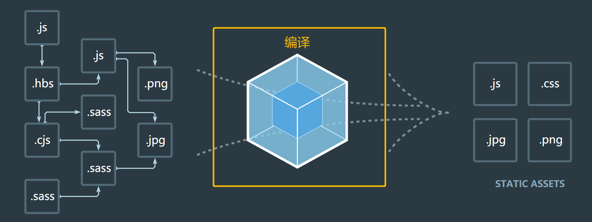
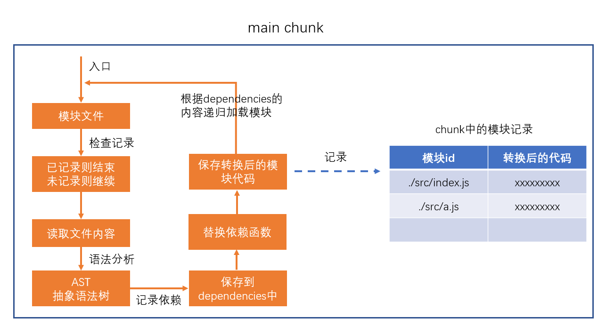
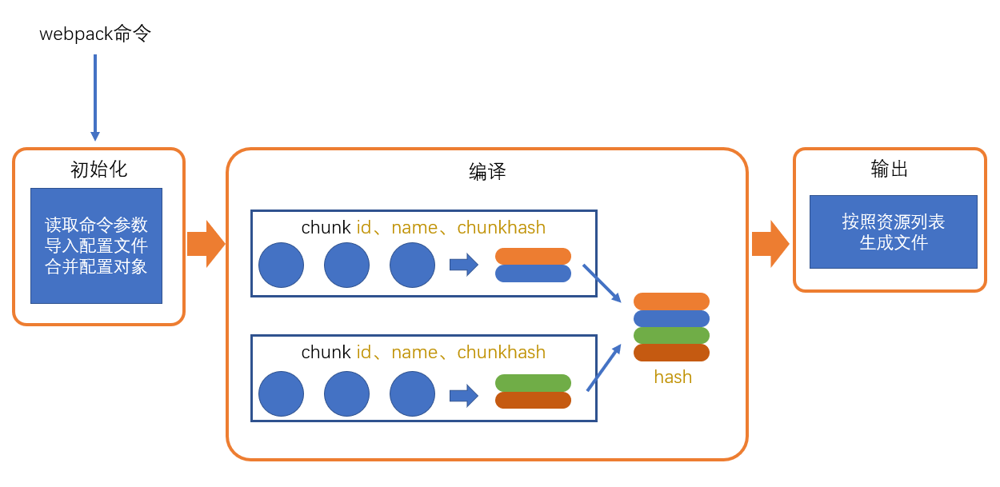
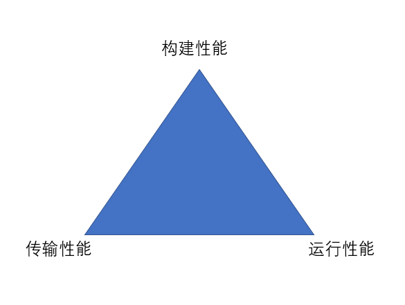

# Webpack
webpack是基于模块化的打包（构建）工具，它把一切视为模块.它通过一个开发时态的入口模块为起点，分析出所有的依赖关系，然后经过一系列的过程（压缩、合并），最终生成运行时态的文件。



## 编译过程
> 大致分为三个步骤：初始化、编译、输出

### 初始化

此阶段，webpack会将CLI参数、配置文件、默认配置进行融合，形成一个最终的配置对象。

对配置的处理过程是依托一个第三方库yargs完成的

### 编译

**1. 创建chunk**

chunk是webpack在内部构建过程中的一个概念，译为块，它表示通过某个入口找到的所有依赖的统称。

根据入口模块（默认为./src/index.js）创建一个chunk（main chunk）

每个chunk都有至少两个属性：
- name：默认为main
- id：唯一编号，开发环境和name相同，生产环境是一个数字，从0开始

**2. 构建所有依赖模块**

从入口文件开始递归处理所有模块



> AST在线测试工具：https://astexplorer.net/

**3. 产生chunk assets**

在第二步完成后，chunk（除了main可能还有其他chunk）中会产生一个模块列表，列表中包含了模块id和模块转换后的代码

接下来，webpack会根据配置为chunk生成一个资源列表，即chunk assets，资源列表可以理解为是生成到最终文件的文件名和文件内容

**4. 合并chunk assets**

将多个chunk的assets合并到一起，并产生一个总的hash

### 输出

此步骤非常简单，webpack将利用node中的fs模块（文件处理模块），根据编译产生的总的assets，生成相应的文件。



**涉及术语**
- module：模块，分割的代码单元，webpack中的模块可以是任何内容的文件，不仅限于JS
- chunk：webpack内部构建模块的块，一个chunk中包含多个模块，这些模块是从入口模块通过依赖分析得来的
- bundle：chunk构建好模块后会生成chunk的资源清单，清单中的每一项就是一个bundle，可以认为bundle就是最终生成的文件
- hash：最终的资源清单所有内容联合生成的hash值
- chunkhash：chunk生成的资源清单内容联合生成的hash值
- chunkname：chunk的名称，如果没有配置则使用main
- id：通常指chunk的唯一编号，如果在开发环境下构建，和chunkname相同；如果是生产环境下构建，则使用一个从0开始的数字进行编号
- 入口：入口真正配置的是chunk，入口通过entry进行配置
  - name：chunkname
  - hash: 总的资源hash，通常用于解决缓存问题
  - chunkhash: 使用chunkhash
  - id: 使用chunkid，不推荐
- 出口：通过output进行配置

### 区分环境
```js
// npx webpack --env abc # env: "abc"
//
// npx webpack --env.abc # env: {abc:true}
// npx webpack --env.abc=1  # env： {abc:1}
// npx webpack --env.abc=1 --env.bcd=2 # env: {abc:1, bcd:2}

// webpack允许配置不仅可以是一个对象，还可以是一个函数
module.exports = env => {
  return {
    //配置内容
  }
}
```

> 面试题：关于 webpack 的打包流程，你有了解过么？

webpack 的打包流程大致可以分为以下几个步骤：
1. 初始化：webpack 通过配置文件和 Shell 参数，初始化参数，确定入口文件、输出路径、加载器、插件等信息。接下来读取配置文件，并合并默认配置、CLI 参数等，生成最终的配置对象。
2. 编译：从入口文件开始，递归解析模块依赖，找到所有需要打包的模块。之后使用 loader 对每个模块进行转换，转换成浏览器能够识别的 JS 代码。
3. 构建模块依赖图：webpack 会为每个模块创建一个模块对象，并根据模块的依赖关系，生成一个模块依赖图（Dependency Graph）。
4. 生成代码块（chunk）：根据入口和依赖图，将所有模块分组，生成一个个包含多个模块的代码块（chunk），这些 chunk 会根据配置生成不同的输出文件。
5. 输出：将生成的代码块输出到指定的文件夹，并根据配置生成对应的静态资源文件。
6. 插件处理：在整个构建过程中，webpack 会在特定的生命周期钩子上执行插件，插件可以对打包的各个阶段进行干预和处理。


## 常用扩展

### 通用

### webpack4
`clean-webpack-plugin` 清除打包目录
`html-webpack-plugin` 自动生成html文件
```js
new HtmlWebpackPlugin({
  template: "./public/index.html"
})
```
`copy-webpack-plugin` 拷贝静态资源
```js
new CopyPlugin([
    { from: "./public", to: "./" }
])
```
file-loader: 生成依赖的文件到输出目录，然后将模块文件设置为：导出一个路径\
url-loader: 生成依赖的文件到输出目录，然后将模块文件设置为:导出一个URL
**解决路径问题**
当产生路径时，loader或plugin只有相对于dist目录的路径，并不知道该路径将在哪个资源中使用，从而无法确定最终正确的路径。面对这种情况，需要依靠webpack的配置publicPath解决

## css工程化

### 抽离css

目前，css代码被css-loader转换后，交给的是style-loader进行处理。

style-loader使用的方式是用一段js代码，将样式加入到style元素中。

而实际的开发中，我们往往希望依赖的样式最终形成一个css文件

`mini-css-extract-plugin`

该库提供了1个plugin和1个loader
- plugin：负责生成css文件
- loader：负责记录要生成的css文件的内容，同时导出开启css-module后的样式对象

```js
const MiniCssExtractPlugin = require("mini-css-extract-plugin")
module.exports = {
    module: {
        rules: [
            {
                test: /\.css$/, use: [MiniCssExtractPlugin.loader, "css-loader?modules"]
            }
        ]
    },
    plugins: [
        new MiniCssExtractPlugin() //负责生成css文件
    ]
}
```
配置生成的文件名

同output.filename的含义一样，即根据chunk生成的样式文件名

配置生成的文件名，例如[name].[contenthash:5].css

默认情况下，每个chunk对应一个css文件

### 拆分css

要拆分css，就必须把css当成像js那样的模块；要把css当成模块，就必须有一个构建工具（webpack），它具备合并代码的能力

而webpack本身只能读取css文件的内容、将其当作JS代码进行分析，因此，会导致错误

于是，就必须有一个loader，能够将css代码转换为js代码

1. `css-loader` css-loader的作用，就是将css代码转换为js代码
- 将css文件的内容作为字符串导出
- 将css中的其他依赖作为require导入，以便webpack分析依赖

它的处理原理极其简单：将css代码作为字符串导出, 类似：
```css
@import "./reset.css";
.red{
    color:"#f40";
    background:url("./bg.png")
}
```
转换为
```js
var import1 = require("./reset.css");
var import2 = require("./bg.png");
module.exports = `${import1}
.red{
    color:"#f40";
    background:url("${import2}")
}`;
```

2. `style-loader` 用于将css代码插入到style标签中，并且在style标签中设置scope属性，以便css模块化

## js兼容性

babel的出现，就是用于解决这样的问题，它是一个编译器，可以把不同标准书写的语言，编译为统一的、能被各种浏览器识别的语言

babel有多种预设，最常见的预设是@babel/preset-env


## 性能优化



## 打包体积 优化思路

- 提取第三方库或通过引用外部文件的方式引入第三方库
- 代码压缩插件`UglifyJsPlugin`
- 服务器启用 gzip 压缩
- 按需加载资源文件 `require.ensure`
- 优化`devtool`中的`source-map`
- 剥离`css`文件，单独打包
- 去除不必要插件，通常就是开发环境与生产环境用同一套配置文件导致

https://www.jianshu.com/p/6b526cc31ba7

## 打包效率

- 开发环境采用增量构建，启用热更新
- 开发环境不做无意义的工作如提取`css`计算文件 hash 等
- 配置`devtool`
- 选择合适的`loader`
- 个别`loader`开启`cache` 如`babel-loader`
- 第三方库采用引入方式
- 提取公共代码
- 优化构建时的搜索路径 指明需要构建目录及不需要构建目录
- 模块化引入需要的部分


## plugin，怎么使用 webpack 对项目进行优化

**构建优化**

- 减少编译体积 `ContextReplacementPugin`、`IgnorePlugin`、`babel-plugin-import`、`babel-plugin-transform-runtime`
- 并行编译 `happypack`、`thread-loader`、`uglifyjsWebpackPlugin`开启并行
- 缓存 `cache-loader`、`hard-source-webpack-plugin`、`uglifyjsWebpackPlugin`开启缓存、`babel-loader`开启缓存
- 预编译 `dllWebpackPlugin && DllReferencePlugin`、`auto-dll-webapck-plugin`

**性能优化**

- 减少编译体积 `Tree-shaking`、`Scope Hositing`
- `hash`缓存 `webpack-md5-plugin`
- 拆包 `splitChunksPlugin`、`import()`、`require.ensure`

## 补充

## 模块化原理

**构建优化**

https://juejin.cn/post/6923991709667819534

https://juejin.cn/post/6844904109775028238

## 打包流程和基本实现


参考1：https://zhuanlan.zhihu.com/p/101541041

参考2：https://zhuanlan.zhihu.com/p/371999555

- webpack 构建流程

Webpack 的运行流程是一个串行的过程,从启动到结束会依次执行以下流程 :
- 初始化参数：从配置文件和 Shell 语句中读取与合并参数,得出最终的参数。
- 开始编译：用上一步得到的参数初始化 Compiler 对象,加载所有配置的插件,执行对象的 run 方法开始执行编译。
- 确定入口：根据配置中的 entry 找出所有的入口文件。
- 编译模块：从入口文件出发,调用所有配置的 Loader 对模块进行翻译,再找出该模块依赖的模块,再递归本步骤直到所有入口依赖的文件都经过了本步骤的处理。
- 完成模块编译：在经过第 4 步使用 Loader 翻译完所有模块后,得到了每个模块被翻译后的最终内容以及它们之间的依赖关系。
- 输出资源：根据入口和模块之间的依赖关系,组装成一个个包含多个模块的 Chunk,再把每个 Chunk 转换成一个单独的文件加入到输出列表,这步是可以修改输出内容的最后机会。
- 输出完成：在确定好输出内容后,根据配置确定输出的路径和文件名,把文件内容写入到文件系统。


**webpack的打包原理是什么**

webpack打包原理是根据文件间的依赖关系对其进行静态分析，将这些模块按指定规则生成静态资源，当webpack处理程序时，它会递归地构建一个依赖关系图，将所有这些模块打包成一个或多个bundle。

webpack有两种组织模块的依赖方式，同步、异步。异步依赖将作为分割点，形成一个新的块；在优化了依赖树之后，每一个异步区块都将作为一个文件被打包。

webpack有一个智能解析器，几乎可以处理任何第三方库。无论它们的模块形式是CommonJS、AMD还是普通的JS文件；甚至在加载依赖的时候，允许使用动态表require("、/templates/"+name+"、jade")。

要承担如下功能：
打包：将多个文件 打包成 一个文件，减少服务器压力和下载带宽
转换：将预编译语言 转换成 浏览器识别的语言
优化：性能优化

webpack 特点：

**代码拆分**

webpack 有两种组织模块的依赖方式，同步、异步
异步依赖将作为分割点，形成一个新的块；在优化了依赖树之后，每一个异步区块都将作为一个文件被打包

**智能解析**

webpack 有一个智能解析器，几乎可以处理任何第三方库
无论它们的模块形式是 CommonJS、 AMD 还是普通的 JS 文件；甚至在加载依赖的时候，允许使用动态表达式 require("./templates/" + name + ".jade")

**快速运行**

webpack 使用异步 I/O 、多级缓存提高运行效率，使得 webpack 以难以令人置信的速度 快速增量编译

## vite和webpack的优缺点

https://cloud.tencent.com/developer/article/1952175

webpack:

识别文件入口，逐层解析将代码转换成AST抽象语法树，再转换成浏览器可以识别的代码

冷启动缓慢

热更新效率低下

vite:

利用浏览器会对设置为module的script标签自动请求，并递归请求内部需求的特点，劫持这些请求，直接返回项目中文件，没有打包编译，速度快

Vite 通过在一开始将应用中的模块区分为 依赖 和 源码 两类，改进了开发服务器启动时间。使用GO编写的ESBuild.

让浏览器接管了打包程序的部分工作：Vite 只需要在浏览器请求源码时进行转换并按需提供源码。根据情景动态导入的代码，即只在当前屏幕上实际使用时才会被处理。

HMR 是在原生 ESM 上执行的。当编辑一个文件时，Vite 只需要精确地使已编辑的模块与其最近的 HMR 边界之间的链失效（大多数时候只需要模块本身），使 HMR 更新始终快速，无论应用的大小。Vite 同时利用 HTTP 头来加速整个页面的重新加载（再次让浏览器为我们做更多事情）：源码模块的请求会根据 304 Not Modified 进行协商缓存，而依赖模块请求则会通过 Cache-Control: max-age=31536000,immutable 进行强缓存，因此一旦被缓存它们将不需要再次请求。

缺点：生态不行，打包用的rollup，esbuild对于js和css代码分割不友好

## webpack5更新了什么

### 清除输出目录

`webpack5`清除输出目录开箱可用，无须安装`clean-webpack-plugin`，具体做法如下：

```js
module.exports = {
  output: {
    clean: true
  }
}
```

### top-level-await

`webpack5`现在允许在模块的顶级代码中直接使用`await`

```js
// src/index.js
const resp = await fetch("http://www.baidu.com");
const jsonBody = await resp.json();
export default jsonBody;
```

目前，`top-level-await`还未成为正式标准，因此，对于`webpack5`而言，该功能是作为`experiments`发布的，需要在`webpack.config.js`中配置开启

```js
// webpack.config.js
module.exports = {
  experiments: {
    topLevelAwait: true,
  },
};
```

### 打包体积优化

`webpack5`对模块的合并、作用域提升、`tree shaking`等处理更加智能

### 打包缓存开箱即用

在`webpack4`中，需要使用`cache-loader`缓存打包结果以优化之后的打包性能

而在`webpack5`中，默认就已经开启了打包缓存，无须再安装`cache-loader`

默认情况下，`webpack5`是将模块的打包结果缓存到内存中，可以通过`cache`配置进行更改

```js
const path = require("path");

module.exports = {
  cache: {
    // 缓存类型，支持：memory、filesystem
    type: "filesystem", 
    // 缓存目录，仅类型为 filesystem 有效
    cacheDirectory: path.resolve(__dirname, "node_modules/.cache/webpack"), 
  },
};
```

> 关于`cache`的更多配置参考：https://webpack.docschina.org/configuration/other-options/#cache

### 资源模块

在`webpack4`中，针对资源型文件我们通常使用`file-loader`、`url-loader`、`raw-loader`进行处理

由于大部分前端项目都会用到资源型文件，因此`webpack5`原生支持了资源型模块

详见：https://webpack.docschina.org/guides/asset-modules/
