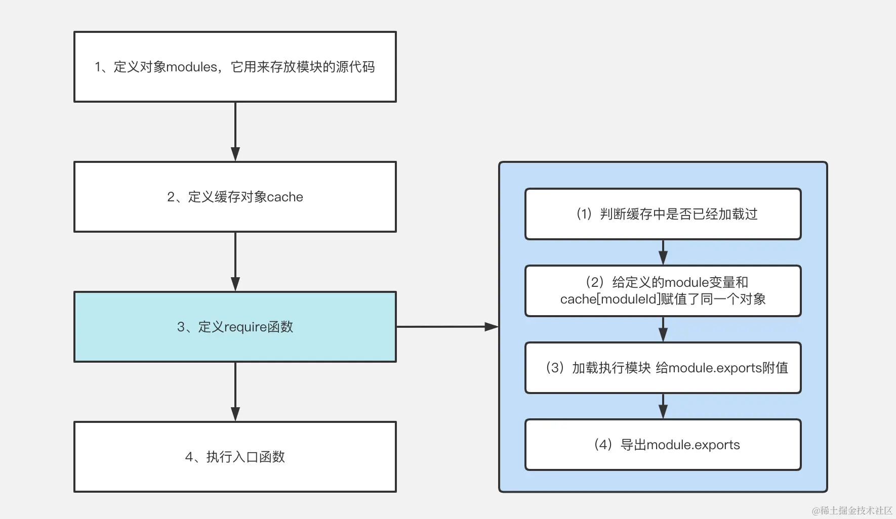
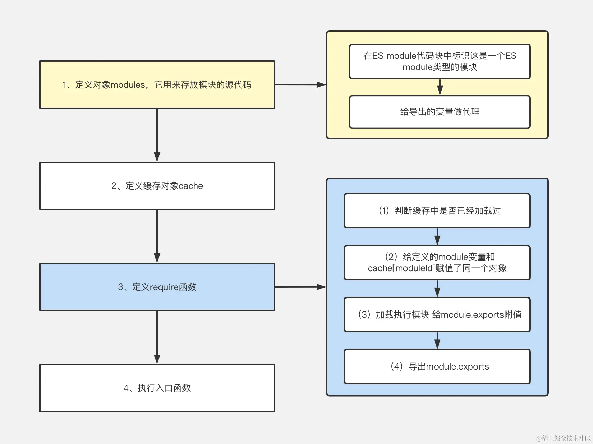

# webpack模块化原理

[从构建产物洞悉模块化原理](https://juejin.cn/post/7147365025047379981/)

> 前置知识
```js
const obj = {};
//定义属性
Object.defineProperty(obj, Symbol.toStringTag, { value: "Module" });
//查看自定义类型
console.log(Object.prototype.toString.call(obj)) //'[object Module]'改变了类型为Module
```

## CommonJS实现模块化的原理



- 在nodejs中实现了`require`和`export`相关的api
- 当执行遇到`require`时
  - 同步执行, 根据路径加载模块文件
  - 放到一个函数中执行，从而产生独立的作用域，仅暴露`export`出的内容
  - 进行缓存，避免重复加载

> 简单原理实现：
```js
//初始化定义modules对象
var modules = {
  // key值为该模块路径，value值为该模块代码, 在require函数执行时获取导出对象。
  "./src/name.js": (module) => {
    // 可以理解为诸如一个module，并创建 var exports = module.exports
    // 因此不能直接给exports赋值
    // 如果写 exports = "不要秃头啊"就不行
    module.exports = "不要秃头啊";  
  },
};

var cache = {}; // 缓存对象

// 定义加载模块函数require， 接受模块的路径为参数，返回具体的模块的内容
function require(modulePath) {
  var cachedModule = cache[modulePath]; //获取模块缓存
  if (cachedModule !== undefined) {
    //如果有缓存则不允许模块内容，直接retuen导出的值
    return cachedModule.exports;
  }
  //如果没有缓存，则定义module对象，定义exports属性
  //这里注意！！！module = cache[modulePath] 代表引用的是同一个内存地址
  var module = (cache[modulePath] = {
    exports: {},
  });
  //运行模块内的代码，在模块代码中会给module.exports对象赋值
  modules[modulePath](module, module.exports, require);

  //导入module.exports对象
  return module.exports;
}

// 执行入口函数, 防止命名冲突，包装成一个立即执行函数。
(() => {
  let author = require("./src/name.js");
  console.log(author, "author");
})();
```
> 用例：
```js
// name.js
module.exports = "不要秃头啊";

// main.js
let author = require("./name.js");
console.log(author, "author");
```

## ESM实现模块化的原理

这事没有`exports`对象给我们赋值了，这可怎么办？
- 将模块中导出的内容还是挂载在`exports`对象上，如果是通过`export default`方式导出的，那就在`exports`对象加一个`default`属性
- webpack在编译时会将`import`语句转换为`require`代码
- 这里给`exports`赋值的方式是通过代理做到的
- 标识这是一个`ES Module`



> 简单原理实现：

```js
//模块定义
var modules = {
  "./src/name.js": (module, exports, require) => {
    //给该模块设置tag：标识这是一个ES Module
    require.setModuleTag(exports);
    //通过代理给exports设置属性值, 只能读不能改？应该是因为esm的规范
    require.defineProperty(exports, {
      age: () => age,
      default: () => DEFAULT_EXPORT,
    });
    
    const author = "不要秃头啊";
    const age = "18";
    const DEFAULT_EXPORT = author;
  },
};

var cache = {};
function require(modulePath) {
  var cachedModule = cache[modulePath];
  if (cachedModule !== undefined) {
    return cachedModule.exports;
  }
  var module = (cache[modulePath] = {
    exports: {},
  });
  modules[modulePath](module, module.exports, require);
  return module.exports;
}

//对exports对象做代理
require.defineProperty = (exports, definition) => {
  for (var key in definition) {
    Object.defineProperty(exports, key, {
      enumerable: true,
      get: definition[key],
    });
  }
};

//标识模块的类型为ES Module
require.setModuleTag = (exports) => {
  Object.defineProperty(exports, Symbol.toStringTag, {
    value: "Module",
  });

  Object.defineProperty(exports, "__esModule", {
    value: true,
  });
};

//以下是main.js编译后的代码
//拿到模块导出对象exports
var _name__WEBPACK_IMPORTED_MODULE_0__ = require("./src/name.js");

console.log(_name__WEBPACK_IMPORTED_MODULE_0__["default"], "author");
console.log(_name__WEBPACK_IMPORTED_MODULE_0__.age, "age");
```
 
> 用例：
```js
// name.js
const author = "不要秃头啊";

export const age = "18";
export default author;

// main.js
import author, { age } from "./name";

console.log(author, "author");
console.log(age, "age");
```

## CommonJS加载ES Module的原理

理解了webpack对esm文件的处理，就可以很轻松的看出，因为打包后esm文件里也有了require，cjs自然可以加载esm了

## ES Module加载CommonJS的原理

```js
var modules = {
  "./src/name.js": (module) => {
    module.exports = "不要秃头啊";
  },
};
var cache = {};
function require(modulePath) {
  var cachedModule = cache[modulePath];
  if (cachedModule !== undefined) {
    return cachedModule.exports;
  }
  var module = (cache[modulePath] = {
    exports: {},
  });
  modules[modulePath](module, module.exports, require);
  return module.exports;
}

// 它用来返回模块的默认导出内容，核心思想依旧是将最终模块的内容导出为一个 exports 对象
require.n = (module) => {
  var getter = module && module.__esModule ? () => module["default"] : () => module;
  require.defineProperty(getter, {
    a: getter,
  });  // 代理，防止外部修改原数据
  return getter;
};

require.defineProperty = (exports, definition) => {
  for (var key in definition) {
    Object.defineProperty(exports, key, {
      enumerable: true,
      get: definition[key],
    });
  }
};

require.setModuleTag = (exports) => {
  Object.defineProperty(exports, Symbol.toStringTag, {
    value: "Module",
  });

  Object.defineProperty(exports, "__esModule", {
    value: true,
  });
};

var __webpack_exports__ = {};
(() => {
  "use strict";
  require.setModuleTag(__webpack_exports__);
  var _name__WEBPACK_IMPORTED_MODULE_0__ = require("./src/name.js");
  var _name__WEBPACK_IMPORTED_MODULE_0___default = require.n(
    _name__WEBPACK_IMPORTED_MODULE_0__
  );
  console.log(_name__WEBPACK_IMPORTED_MODULE_0___default(), "author");
})();

```

## 题目
> 控制台会输出什么呢？
```js
// a.js
const getMes = require('./b')
console.log('我是 a 文件')
exports.say = function(){
    const message = getMes()
    console.log(message)
}


// b.js
const say = require('./a')
const  object = {
    name:'从构建产物洞悉模块化原理',
    author:'不要秃头啊'
}
console.log('我是 b 文件')
module.exports = function(){
    return object
}

// main.js
const a = require('./a')
const b = require('./b')

console.log('node 入口文件')
```

```text
我是 b 文件
我是 a 文件
node 入口文件
```

**解析**
1. require a 的时候，去加载 a 的代码，
2. 在实际执行前，会提前声明一个空对象最为a export 的导出值，并赋值给cache，cache['./a'] = {}
3. 实际开始加载a，a 在加载的过程中，碰到 require('./b')，然后开始加载 b，并且也会提前声明一个空对象赋值给 cache，cache['./b'] = {};
4. 实际开始加载b，此时发现要加载a，先从缓存中取，取到了（可以在b 文件加一行日志，console.loog(say) 你会发现它就是空对象）。就继续往下执行。输出【我是b 文件】
5. require('./b’) 执行完成，执行a 后续代码，输出【我是a'文件】
6. main 的第一行执行完成，执行第二行 require('./b') ，此时直接从缓存中取到了值
7. 最后输出【node 入口文件】

