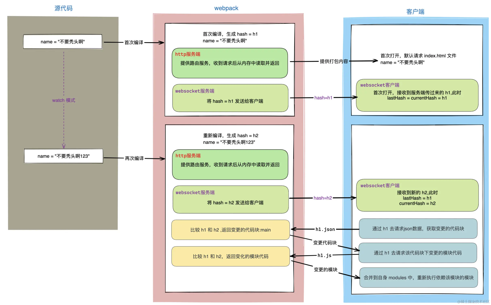

# 热更新原理

[Webpack深度进阶：两张图彻底讲明白热更新原理！](https://juejin.cn/post/7176963906844246074)

**两个文件**
websocket 相关的代码，用来跟服务端通信
客户端接收到最新代码后，更新代码

**两个服务**
一个本地 HTTP 服务：这个本地服务会给我们提供编译之后的结果，之后浏览器通过端口请求时，就会请求本地服务中编译之后的内容，默认端口号 8080。
一个 websocket 双向通信服务器：如果有新的模块发生变化，编译成功会以消息的方式通知客户端，让客户端来请求最新代码，并进行客户端的热更新。

**chunk和module**
chunk 就是若干 module 打成的包，一个 chunk 包括多个 module，一般来说最终会形成一个 file。而 module 就是一个个代码模块。

1. 初次编译webpack 内部会生成一个`hash = h1`，并通过 websocket 的方式通知给客户端
   1. 客户端上有两个变量：lastHash（上一次接收到的 hash）、currentHash（这一次接收到的 hash）
2. 源代码修改后重新编译生成新的`hash=h2`发送给客户端，客户端收到后修改currentHash
3. 客户端发现不同的hash值，根据lastHash向服务端请求变更的代码块的json数据
4. 服务端接收到请求后，将传过来的 h1 和 自身最新的 hash = h2 进行对比，找出 变更的代码块（chunk：main） 后返回给客户端
5. 客户端在收到响应后，知道了哪些代码块（chunk：main）发生了变化，接着会继续通过 lastHash = h1（main.h1.js）向服务端去请求 变更代码块（chunk：main）中的变动模块代码
6. 服务端接收到 js 请求（main.h1.js）后，将传过来的 h1 和 自身最新的 hash = h2 再次进行对比，找出具体 变更的模块代码（src/name.js） 后返回给客户端。
7. 最后，客户端拿到了变更模块的代码，重新去执行依赖该模块的模块（比如 src/name.js 被修改了，src/index.js 依赖 src/name.js，那就要重新执行 src/index.js 这个模块），达到更新的目的

> 这里可能有同学要问了：为什么客户端会有两个 hash 值？

这么设计的用意：服务端不知道现在客户端的 hash 是多少，万一此时又连接一个客户端（多窗口的场景）怎么办。所以这里需要客户端将上一次的 hash 返回给服务端，服务端通过比较后才返回变更的代码块。

> 如果每次文件改变都重新编译，那性能跟得上吗？

这里为了提升性能，webpack-dev-server 使用了一个库叫 memfs，它是 Webpack 官方自己写的。

这样每次打包之后的结果并不会进行输出（把文件写入到硬盘上会耗费很长的时间），而是将打包后的文件保留在内存中，以此来提升性能。