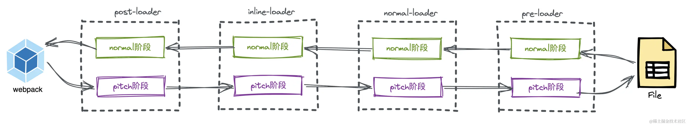

# 构建体系03-webpack中的Loader机制
> Webpack本身只能处理 js 和 JSON 文件，其他类型文件它是不能够处理的。需要借助 Loader 来处理这些类型的文件，并将它们转换为有效的模块

[【万字长文｜趣味图解】彻底弄懂Webpack中的Loader机制](https://juejin.cn/post/7157739406835580965)

Loader 的本质是什么？
在 Webpack 中如何使用自定义 Loader？有几种方式？
Loader 的类型有哪几种？它们的运行顺序是怎么样的？如何控制它们的运行顺序？
什么是 Normal Loader？什么是 Pitching Loader？它们的运行机制有什么不同？
如果一个文件指定了多个 Loader，如何控制使得只执行特定的 Loader，忽略其他的 Loader?
Loader 为什么是自右向左执行的？如何做到的？
项目中对.css、.less、.scss、.tsx、.vue等文件是如何做解析的？它们的原理是什么？
Webpack 中完整的 Loader 运行机制是怎么样的？
为什么最后的 Loader 处理结果必须是JS类型的字符串？
给你个需求：需要在打包过程中移除console.log函数，你会通过哪种方式进行处理？是通过 Loader 还是 Babel Plugin？再或者是 Webpack Plugin？给出你的理由

> Loader 本质上是导出为`函数`的 JavaScript 模块。它接收资源文件或者上一个 Loader 产生的结果作为入参，也可以用多个 Loader 函数组成 loader chain（链），最终输出转换后的结果。
> loader chain（链），它们的执行顺序是从右向左，或者说是从下往上执行的
```js
/**
 *
 * @param {string|Buffer} content 源文件的内容
 * @param {object} [map] 可以被 https://github.com/mozilla/source-map 使用的 SourceMap 数据
 * @param {any} [meta] meta 数据，可以是任何内容
 */
function webpackLoader(content, map, meta) {
  // 你的 webpack loader 代码
}
```

> 配置loader的三种方式：
- 配置 Loader 的绝对路径
```js
{
    test: /\.js$/,
    use: [
      {
        loader: path.resolve(__dirname, "./loaders/simpleLoader.js"),
        options: {
          /* ... */
        },
      },
    ],
},
```
- 配置 resolveLoader.alias 配置别名
```js
resolveLoader: {
    alias: {
        "simpleLoader": path.resolve(__dirname, "./loaders/simpleLoader.js"),
    },
},
module: {
    rules: [
      {
        test: /\.js$/,
        use: [
          {
            loader: "simpleLoader",
            options: {
              /* ... */
            },
          },
        ],
      },
    ],
},
```
- 配置 resolveLoader.modules
```json
  resolveLoader: {
    // 找loader的时候，先去loaders目录下找，找不到再去node_modules下面找
    modules: ["loaders", "node_modules"],
  },
  module: {
    rules: [
      {
        test: /\.js$/,
        use: [
          {
            loader: "simpleLoader",
            options: {
              /* ... */
            },
          },
        ],
      },
    ],
  },
```

> loader的四种类型

Loader 按[类型](https://webpack.docschina.org/configuration/module/#ruleenforce)分可以分为四种：前置(pre)、普通(normal)、行内(inline)、后置(post)。

我们平常使用的大多数就是 普通(normal)类型的，这里要说明的一个点是 Loader 的类型和它本身没有任何关系，而是和配置的 enforce属性有关系。
```js
  module: {
    rules: [
      {
        test: /\.css$/,
        use: ["css-loader"],
        enforce: "pre", //这里也可以是post，默认不写就是normal
      },
    ],
  },
```

> loader的两个阶段



- Pitching阶段: Loader上的 pitch 方法, Loader导出函数上的pitch属性
  - 按照后置(post)、行内(inline)、普通(normal)、前置(pre)的顺序调用。
  - 在 Pitch 阶段，如果执行到该 Loader 的 pitch 属性函数时有返回值，就直接结束 Pitch阶段，并直接跳到该Loader pitch 阶段的前一个 Loader 的 normal 阶段继续执行（若无前置Loader，则直接返回）
  - 三个参数`PreviousRequest、remainingRequest、data`
    - PreviousRequest代表的是之前执行过pitch阶段的loader
    - remainingRequest代表未执行过pitch阶段的loader
    - data，可以用于数据传递。即在 pitch 函数中往 data 对象上添加数据，之后在 normal 函数中通过 `this.data` 的方式读取已添加的数据，也就是注入上下文
- Normal阶段: Loader 上的 常规方法，就是Loader文件最后导出的函数
  - 按照前置(pre)、普通(normal)、行内(inline)、后置(post) 的顺序调用。模块源码的转换， 发生在这个阶段。
- 同等类型下的 Loader 执行顺序才是由右向左，或者由下到上执行。

**一个实际的应用场景**
在项目开始构建之前，为了更早的发现错误，一般会先进行 eslint 校验。这个时候就需要前置(pre) Loader，如果在前置 Loader 中发现了错误那就提前退出构建

```js
  module: {
    rules: [
      {
        test: /\.js$/,
        use: ["eslint-loader"],
        enforce: "pre", //编译前先对js文件进行校验
      },
      {
        test: /\.js$/,
        use: ["babel-loader"],
      },
    ],
  },
```

思考题：像上面这样配置前置 Loader 去校验文件，它是在编译前先校验所有的 .js 文件再编译，还是校验一个编译一个呢？这样真的能够更早的发现错误吗？

答案：校验一个编译一个，至于原因后面 手写 webpack 文章 中会有详细讲解。

> loader的内联方式

```js
import test from "c-loader!./test.js"; //使用内联Loader
import test from "!c-loader!./test.js"; // 忽略指定的loader
import test from "!!c-loader!./test.js";  // 只使用内联loader，忽略其它
import test from "-!c-loader!./test.js"; // 将禁用所有已配置的 preLoader 和 normal loader

const a = 1;
```


