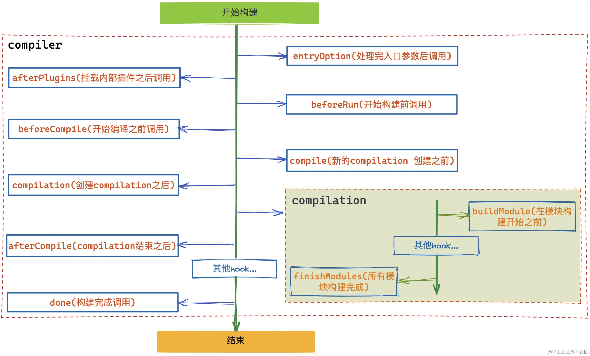

# Plugin
> 使用阶段式的构建回调，开发者可以在 Webpack 构建流程中引入自定义的行为

[Webpack Plugin](https://juejin.cn/post/7160467329334607908)
[Tapable](https://juejin.cn/post/7164175171358556173)

> tapable与webpack：Webpack 本质上是一种事件流的机制，它的工作流程就是将各个插件串联起来，而实现这一切的核心就是 tapable。

> Webpack 内部通过 tapable 会提前定义好一系列不同阶段的 hook ，然后在固定的时间点去执行（触发 call 函数）。而插件要做的就是通过 tap 函数注册自定义事件，从而让其控制在 Webapack 事件流上运行
- tapable: 类似于 Node.js 中的 EventEmitter 的库，但它更专注于自定义事件的触发和处理。通过 tapable 我们可以注册自定义事件，然后在适当的时机去触发执行
  - 类比到 Vue 和 React 框架中的生命周期函数，它们就是到了固定的时间节点就执行对应的生命周期，tapable 做的事情就和这个差不多，可以先注册一系列的生命周期函数，然后在合适的时间点执行
  - 发布订阅模式
  - hook
    - Basic（基本的）：执行每一个事件函数，不关心函数的返回值
    - Waterfall（瀑布式的）：如果前一个事件函数的结果 result !== undefined，则 result 会作为后一个事件函数的第一个参数（也就是上一个函数的执行结果会成为下一个函数的参数）
    - Bail（保险的）：执行每一个事件函数，遇到第一个结果 result !== undefined 则返回，不再继续执行（也就是只要其中一个有返回了，后面的就不执行了）
    - Loop（循环的）：不停的循环执行事件函数，直到所有函数结果 result === undefined

> Compiler 和 Compilation 
- compiler 对象代表了完整的 webpack 生命周期.
  - 在启动 Webpack 时被一次性建立，并配置好所有可操作的设置，包括 options，loader 和 plugin。当在 Webpack 环境中应用一个插件时，插件将收到此 compiler 对象的引用。可以使用它来访问 Webpack 的主环境
  - [compiler上挂载的 hook](https://webpack.docschina.org/api/compiler-hooks/) 
- compilation 对象代表了一次资源版本构建
  - 当运行 Webpack 开发环境中间件（ webpack-dev-server）时，每当检测到一个文件变化，就会创建一个新的 compilation，从而生成一组新的编译资源。一个 compilation 对象表现了当前的模块资源、编译生成资源、变化的文件、以及被跟踪依赖的状态信息。compilation 对象也提供了很多关键时机的回调，以供插件做自定义处理时选择使用
  - [compilation上挂载的 hook](https://webpack.docschina.org/api/compilation-hooks/)



## 编写插件
> plugin的本质是一个带有apply方法的类

> apply函数会在初始化阶段，创建好Compiler对象后运行

```js
class DemoPlugin {
  // webpack将会调用该方法注册插件
  apply(compiler) {
    //在done（构建完成后执行）这个hook上注册自定义事件
    compiler.hooks.done.tap("DemoPlugin", () => {
      console.log("DemoPlugin：编译结束了");
    });
  }
}

module.exports = DemoPlugin;

```

## Tapable 源码

懒编译或者叫动态编译 : 只有在执行 call 方法时才会去动态生成执行函数，如果不执行则不处理，[极致的性能](https://github.com/webpack/tapable/issues/162)

```js
let func = new Function ([arg1, arg2, ...argN], functionBody);

// arg1, arg2, ... argN（参数名称）：是一个有效的 JavaScript 字符串（例如："a , b"），或者是一个字符串列表（例如：["a"，"b"]）。
// functionBody（函数体）：可执行的JavaScript字符串。
```

JavaScript 引擎的编译优化:

- new Function 方法: 当你使用 new Function 创建一个函数时，这个函数通常会被 JavaScript 引擎`视为一个独立的脚本`。
  - 这意味着它可以进行更彻底的优化。由于该函数是在运行时创建的，引擎有机会根据当前上下文优化它，这可以包括内联优化、避免不必要的变量查找等。
  - 在它的内部直接编码了所有的函数调用。这种方式减少了函数调用的次数，因为所有的调用都被内联到一个单独的函数体内。这就减少了调用栈的变化，提高了执行效率
  
- forEach 循环: 相比之下，使用 forEach 循环直接调用数组中的函数则涉及到多次函数调用的开销。
  - 每次循环都会调用一个函数，这可能会导致更多的上下文切换和较少的优化机会。每次函数调用都涉及到创建新的调用栈、传递参数等开销。
  函数调用的开销:

总之，使用 new Function 创建的函数，由于更优的编译优化和减少的函数调用开销，往往在性能上优于简单的 forEach 循环调用。然而，这种优化的程度可能会因 JavaScript 引擎的实现细节而有所不同，而且它也带来了代码的复杂性和可维护性的挑战。在实际应用中，选择哪种方法取决于具体场景和性能需求。