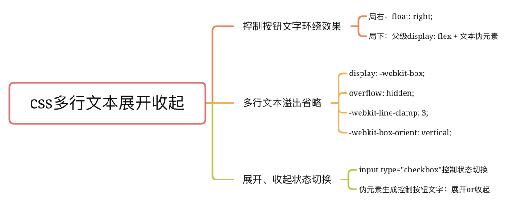

<script setup>
import demo from './demo.vue'
import demoCode from './demo.vue?raw'
</script>

# 多行文本展开收起

[CSS 实现多行文本展开收起效果](https://www.cnblogs.com/niejunchan/p/15078198.html)



<preview :code="demoCode">
  <demo />
</preview>


> 自定义指令版
```js
var directives = {
        // 自动添加展开的指令
        expand: {
            inserted: function (el, binding) {
                if (binding.value) {
                    const rawHtml = el.innerHTML;
                    const rawStyle = el.getAttribute('style');
                    const lineClamp = Number.isInteger(binding.value) ? binding.value : 1;

                    // 设置临时样式用于判断是否需要expand
                    el.innerHTML = rawHtml.replaceAll('p>', 'div>'); // 将内部p标签替换
                    el.setAttribute('style', `
                        display: -webkit-box;
                        overflow: hidden;
                        -webkit-line-clamp: ${lineClamp};
                        -webkit-box-orient: vertical;
                        white-space: normal;
                    `);

                    setTimeout(() => {
                        console.log(el.scrollHeight, el.clientHeight);
                        
                        if(el.scrollHeight === el.clientHeight) {
                            // 不需要expand，还原现场
                            el.innerHTML = rawHtml;
                        } else {
                            // 生成随机id
                            const uuid = 'xxxxxxxx-xxxx-4xxx-yxxx-xxxxxxxxxxxx'.replace(/[xy]/g, function (c) {
                                const r = Math.random() * 16 | 0; // 生成 0 到 15 之间的随机数
                                const v = (c === 'x') ? r : (r & 0x3 | 0x8); // 根据 UUID v4 的规则生成
                                return v.toString(16); // 转换为十六进制
                            });

                            el.innerHTML = `
                                <input type="checkbox" id="${uuid}">
                                <div class="expand-text" ${lineClamp === 1 ? '' : `style="-webkit-line-clamp: ${lineClamp};"`}>
                                    <label for="${uuid}" class="expand-btn">展开</label>
                                    <span>${el.innerHTML}</span>
                                </div>
                            `;
                            el.classList.add('expand-block');
                        }

                        // 还原style
                        if(rawStyle) {
                            el.setAttribute('style', rawStyle);
                        } else {
                            el.removeAttribute('style');
                        }
                    }, 100)
                }
            }
        }
    }
```