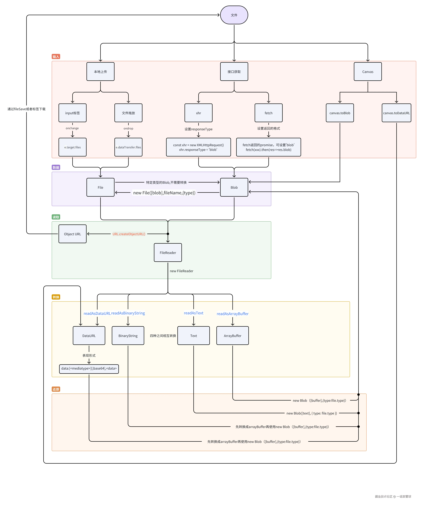

# Blob和File和ArrayBuffer
> JavaScript 在处理文件、二进制数据和数据转换时，提供了一系列的 API 和对象
> 比如 `File`、`Blob`、`FileReader`、`ArrayBuffer`、`Base64`、`Object URL` 和 `DataURL`

[js二进制及其相关转换全总结(File、Blob、FileReader、ArrayBuffer、Base64、Object URL、DataURL...)](https://juejin.cn/post/7395866692798201871)
[前端中的 File 和 Blob两个对象到底有什么不同](https://juejin.cn/post/7413921824066551842)



## Blob
> 在 JavaScript 中，Blob（Binary Large Object）对象用于表示不可变的、原始的二进制数据。 它可以用来存储文件、图片、音频、视频、甚至是纯文本等各种类型的数据。

> Blob 提供了一种高效的方式来操作数据文件，而不需要将数据全部加载到内存中，这在处理大型文件或二进制数据时非常有用。

### 创建方式
- 手动创建
```js
// blobParts: 一个数组，包含将被放入 Blob 对象中的数据，可以是字符串、数组缓冲区（ArrayBuffer）、TypedArray、Blob 对象等
// options: 一个可选的对象，可以设置 type（MIME 类型）和 endings（用于表示换行符如何写入默认transparent）
// const blob = new Blob(blobParts, options);
const blob = new Blob(["Hello, world!"], { type: "text/plain" });
```
- xhr返回的responseType='blob'
- fetch返回结果设置为的blob
- canvas.toBlob()

**主要属性**
- size: 返回 Blob 对象的大小（以字节为单位）
- type: 返回 Blob 对象的 MIME 类型

**主要方法**
- slice： 从 Blob 中提取一部分数据，并返回一个新的 Blob 对象。参数 start 和 end 表示提取的字节范围
- text: 读取为文本字符串，返回一个 Promise
- arrayBuffer：读取为 ArrayBuffer 对象，适合处理二进制数据，返回一个 Promise
- stream：作为一个 ReadableStream 返回，允许你以流的方式处理数据，适合处理大文件

**MIME**
- text/plain 纯文本文档 
- text/html HTML文档
- text/javascript JavaScript文件
- text/css CSS文件
- application/json JSON文件
- application/pdf  PDF文件
- application/xml XML文件
- image/jpeg JPEG图像
- image/png PNG图像
- image/svg+xml SVG图像
- audio/mpeg MP3文件
- video/mpeg MP4文件

### 使用场景
1. 生成文件下载
```js
const blob = new Blob(["This is a test file."], { type: "text/plain" });
const url = URL.createObjectURL(blob); // 创建一个 Blob URL，URL 的生命周期与其创建时所在窗口的 document 绑定在一起
const a = document.createElement("a");
a.href = url;
a.download = "test.txt";
a.click();
URL.revokeObjectURL(url); // 释放 URL 对象
```
2. 上传文件
通过 FormData 对象将 Blob 作为文件上传到服务器
```js
const formData = new FormData();
formData.append("file", blob, "example.txt");

fetch("/upload", {
    method: "POST",
    body: formData,
}).then((response) => {
    console.log("File uploaded successfully");
});
 // 释放 URL 对象
```
3. 读取图片或其他文件
通过 FileReader API 可以将 Blob 对象读取为不同的数据格式。举例来说，你可以将 Blob 读取为图片并显示在页面上
```js
fileInput.addEventListener("change", function (event) {
    const file = event.target.files[0];

    if (file && file.type.startsWith("image/")) {
      const reader = new FileReader();

      reader.onload = function (e) {
        const img = document.createElement("img");
        img.src = e.target.result;
        img.style.maxWidth = "500px";
        img.style.margin = "10px";
        imageContainer.innerHTML = "";
        imageContainer.appendChild(img);
      };

      reader.readAsDataURL(file);
    } else {
      alert("请选择一个有效的图片文件。");
    }
});
```
将 Blob 转换为 Base64 编码的数据（例如用于图像的内联显示或传输）
```js
const reader = new FileReader();
reader.onloadend = function () {
    const base64data = reader.result;
    console.log(base64data); // 输出 base64 编码的数据
};

reader.readAsDataURL(blob); // 将 Blob 文件读取为 Base64 编码的 Data URL
```

**FileReader**
> 允许 Web 应用程序异步读取存储在用户计算机上的文件（或原始数据缓冲区）的内容，使用 File 或 Blob 对象指定要读取的文件或数据
- readAsDataURL：将文件的数据表示为 base64 编码字符串
- readAsText：包含表示文件内容的文本字符串
- readAsArrayBuffer：包含一个表示文件数据的 ArrayBuffer，将文件读取为数组缓冲区
- abort： 中止读取操作

## File
> File 是 JavaScript 中代表文件的数据结构, 包含文件的元数据（如文件名、文件大小、类型等）
> 继承自 Blob 对象，可以将 File 对象看作是带有文件信息的 Blob

**创建**
- `new File([], filename, options)` 手动创建
- `<input type="file">`选择文件时上传
- 文件拖放`ondrop`时的`e.dataTransfer.files`

## Base64
> Base64 是一种将二进制数据转换为 ASCII 字符串的编码方式，用于在文本环境中传输二进制数据

在 JavaScript 中，有两个函数被分别用来处理解码和编码 base64 字符串：
- `atob()`：解码，解码一个 Base64 字符串；
- `btoa()`：编码，从一个字符串或者二进制数据编码一个 Base64 字符串。

## ArrayBuffer 
> 用来表示通用的原始二进制数据缓冲区

## 相互转换

> Data URL =>
```js
// Data URL -> ArrayBuffer
function dataURLToArrayBuffer(dataURL) {
    const binaryString = atob(dataURL.split(',')[1]);
    const len = binaryString.length;
    const bytes = new Uint8Array(len);
    for (let i = 0; i < len; i++) {
        bytes[i] = binaryString.charCodeAt(i);
    }
    return bytes.buffer;
}

// Data URL -> Binary String
function dataURLToBinaryString(dataURL) {
    return atob(dataURL.split(',')[1]);
}

// Data URL -> Text
async function dataURLToText(dataURL) {
    const arrayBuffer = dataURLToArrayBuffer(dataURL);
    return arrayBufferToText(arrayBuffer);
}

// Data URL -> Blob
function dataURLToBlob(dataURL) {
    const byteString = atob(dataURL.split(',')[1]);
    const mimeString = dataURL.split(',')[0].split(':')[1].split(';')[0];
    const ab = new ArrayBuffer(byteString.length);
    const ia = new Uint8Array(ab);
    for (let i = 0; i < byteString.length; i++) {
        ia[i] = byteString.charCodeAt(i);
    }
    return new Blob([ia], { type: mimeString });
}

```
> ArrayBuffer =>
```js
// ArrayBuffer -> Data URL 
function arrayBufferToDataURL(arrayBuffer, mimeType = 'application/octet-stream') {
    const bytes = new Uint8Array(arrayBuffer);
    const binaryString = bytes.reduce((data, byte) => data + String.fromCharCode(byte), '');
    return `data:${mimeType};base64,${btoa(binaryString)}`;
}

// ArrayBuffer -> Binary String
function arrayBufferToBinaryString(arrayBuffer) {
    const bytes = new Uint8Array(arrayBuffer);
    return bytes.reduce((data, byte) => data + String.fromCharCode(byte), '');
}

// ArrayBuffer -> Text
function arrayBufferToText(arrayBuffer) {
    const decoder = new TextDecoder('utf-8');
    return decoder.decode(new Uint8Array(arrayBuffer));
}

// ArrayBuffer -> Blob 
function arrayBufferToBlob(arrayBuffer, mimeType = 'application/octet-stream') {
    return new Blob([arrayBuffer], { type: mimeType });
}
```
> Binary String =>
```js
// Binary String -> ArrayBuffer
function binaryStringToArrayBuffer(binaryString) {
    const len = binaryString.length;
    const bytes = new Uint8Array(len);
    for (let i = 0; i < len; i++) {
        bytes[i] = binaryString.charCodeAt(i);
    }
    return bytes.buffer;
}

// Binary String -> Data URL
function binaryStringToDataURL(binaryString, mimeType = 'application/octet-stream') {
    return `data:${mimeType};base64,${btoa(binaryString)}`;
}

// Binary String -> Text
function binaryStringToText(binaryString) {
    return decodeURIComponent(escape(binaryString));
}

// Binary String -> Blob
function binaryStringToBlob(binaryString, mimeType = 'application/octet-stream') {
    const ab = new ArrayBuffer(binaryString.length);
    const ia = new Uint8Array(ab);
    for (let i = 0; i < binaryString.length; i++) {
        ia[i] = binaryString.charCodeAt(i);
    }
    return new Blob([ia], { type: mimeType });
}

```
> Text =>
```js
// Text -> ArrayBuffer
function textToArrayBuffer(text) {
    const encoder = new TextEncoder();
    return encoder.encode(text).buffer;
}
//  Text -> Binary String
function textToBinaryString(text) {
    return unescape(encodeURIComponent(text));
}
// Text -> Data URL
function textToDataURL(text, mimeType = 'text/plain') {
    const arrayBuffer = textToArrayBuffer(text);
    return arrayBufferToDataURL(arrayBuffer, mimeType);
}
// Text -> Blob
function textToBlob(text, mimeType = 'text/plain') {
    return new Blob([text], { type: mimeType });
}
```
