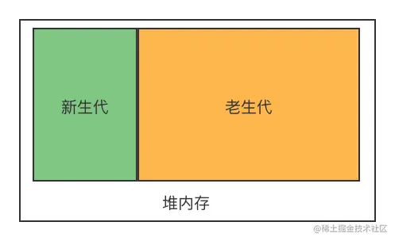
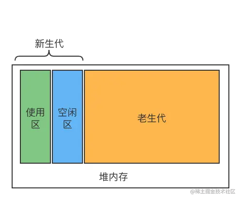

# 内存管理

> JavaScript 是在创建对象时自动分配内存，并在不再使用时自动释放内存（垃圾回收）。这个自动性是混乱的潜在根源：它让开发者错误地以为他们不需要担心内存管理

64位系统下为1.4GB，32位系统下为0.7GB

## 垃圾回收
> 大多数内存管理的问题出现在这个阶段。这个阶段最难的任务是确定已分配的内存何时不再需要了

### 引用计数垃圾回收
> 现代 JavaScript 引擎不再使用引用计数进行垃圾回收

这是最初级的垃圾回收算法。此算法把确定对象是否仍然需要这个问题简化为确定对象是否仍有其他引用它的对象。如果没有指向该对象的引用，那么该对象称作“垃圾”或者可回收的

循环引用导致内存泄露：引用计数算法不会认为它们可以被回收，因为每个对象至少还有一个指向自己的引用，这样的结果就是它们两个都不会被标记为可以被垃圾回收

### 标记清除法
> 将“对象不再需要”这个定义简化为“对象不可达”
> 当前，所有现代的引擎搭载的是标记清除垃圾回收器

这个算法假定有一组叫做`根`的对象。在 JavaScript 中，根是全局对象。**垃圾回收器将定期从这些根开始，找到从这些根能引用到的所有对象，然后找到从这些对象能引用到的所有对象，等等。**从根开始，垃圾回收器将找到所有可到达的对象并收集所有不能到达的对象。

这个算法是对上一个算法的改进。因为对于引用计数算法，有零引用的对象实际上是不可达的，但是有引用的对象却不一定，就像在循环引用中看到的那样。

大致过程：
- 垃圾收集器在运行时会给内存中的所有变量都加上一个标记
- 从各个根对象开始遍历，把还在被上下文变量引用的变量标记去掉标记
- 清理所有带有标记的变量，销毁并回收它们所占用的内存空间
- 最后垃圾回收程序做一次内存清理
  - **标记整理**： 记清除之后，剩余的对象内存位置是不变的，也会导致空闲内存空间是不连续的，这就造成出现内存碎片的问题。
  - 

#### V8对垃圾回收机制的优化

1. 分代式垃圾回收

- 分代式垃圾回收：新生代和老生代
  - 新生代：存活时间较短的变量
  - 老生代：存活时间较长的变量，简单来说就是经历过新生代垃圾回收后还存活下来的对象，容量通常较大

**新生代内存回收**
> 对于新生代使用Scavenge算法回收，基于复制算法，将新生代又划分为两个区域：使用区From和空闲区To
> 
> Scavenge 算法的特点是速度快，适合处理生命周期短的对象，这也是其在新生代垃圾回收中占主导地位的原因。
> 
> 为新生代对象分配连续的内存空间。如果新生代空间不足，会触发垃圾回收

- 内存划分：新加入的对象都会存放在使用区，当使用区快写满时就进行一次垃圾清理操作
- 标记存活对象：在开始进行垃圾回收时，V8会扫描标记存活的对象
- 复制过程：将存活的对象拷贝到空闲区，更新对应的引用
- 交换角色：使用区->空闲区，空闲区->使用区
> 新生代中的变量如果经过回收之后依然一直存在，那么会放入到老生代内存中。

**老生代内存回收**
> 对于老生代的对象，V8 使用了其他的垃圾回收算法（如 Mark-Sweep 和 Mark-Compact）
使用Mark-Sweep（标记清除）和Mark-Compact（标记整理）的策略进行老生代内存中的垃圾回收。

2. 增量标记

为了避免长时间的垃圾回收导致主线程阻塞（“全停顿”问题），V8 引入了增量标记。
将标记阶段**分为多个小步骤**，穿插在 JavaScript 执行过程中。
减少垃圾回收对应用性能的影响。

3. 惰性清理

在标记完成后，V8 不会立即清理未标记的对象，而是延迟到需要分配内存时再进行清理。

进一步减少垃圾回收对主线程的影响

4. 并行和并发回收：利用多核 CPU 提高效率

## 内存泄露和优化
常见内存泄露的原因：
- 过多的缓存
- 滥用闭包
- 过多的定时器
- 太多无效DOM引用
- 滥用全局变量
- 逻辑bug，死循环

## 配置引擎的内存模型

JavaScript 引擎典型地提供了暴露内存模型的标志。例如，Node.js 为配置和调试内存问题提供了暴露底层的 V8 机制的额外选项和工具。这个配置可能在浏览器中不能使用，Web 页面更不用说（通过 HTTP 标头，等等）。

## 帮助内存管理的数据结构

- WeakMap 和 WeakSet 
- WeakRefs 和 FinalizationRegistry

