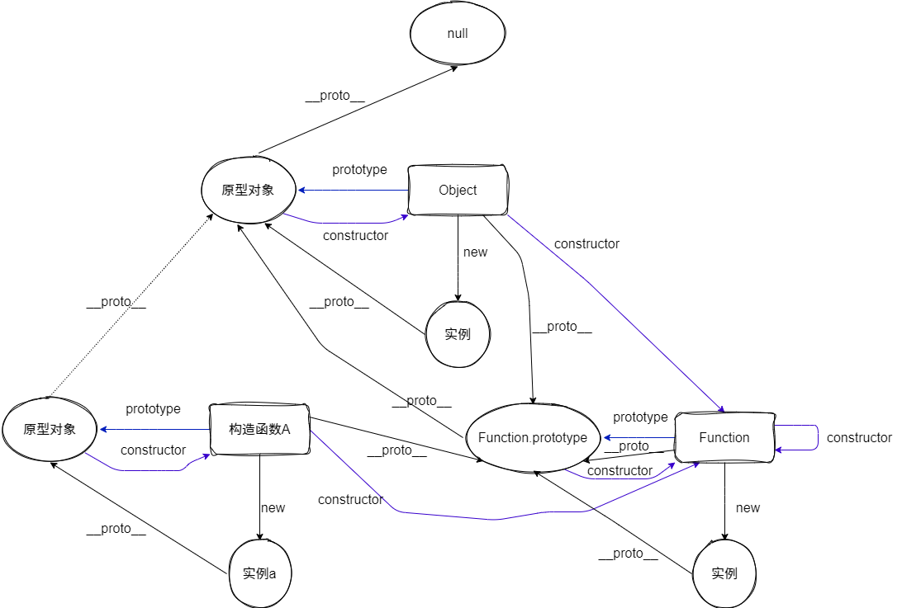

# 原型链
> 在 js 创立的时候，是秉持着流行的万物皆对象的思想，但只是想创建一门简单的语言，不想实现类和继承这样 C++、java 等语言复杂的机制，但又需要这种功能。在实现的时候不像 C++等语言`new 类`，然后调用”类“对应的”构造函数“，js 是`new 构造函数(constructor)`。但用构造函数生成实例对象，有一个缺点，就是无法共享属性和方法。因此创建了`prototype`属性对象（显示原型）。

- `prototype（显式原型）`

  - <span style="color: red;">每一个函数（仅限函数）在创建之后都会拥有一个名为 prototype 的属性，这个属性指向函数的原型对象。</span>
  - 作用：用于放某同一类型实例的共享属性和方法，**不会反复开辟存储空间，减少内存浪费**，
    - 这个属性是一个指针，指向一个对象，这个对象的用途就是包含所有实例共享的属性和方法（我们把这个对象叫做原型对象）。
    - 原型对象也有一个属性，叫做 constructor，这个属性包含了一个指针，指回原构造函数。
  - 原型中 this 指向实例化对象
  - **Note**：通过`Function.prototype.bind`方法构造出来的函数是个例外，它没有 prototype 属性。

- `[__proto__]（隐式原型）`:
  - `JavaScript`的所有对象中都包含了一个 `__proto__` 内部属性，所有引用类型都有，指向构造函数的显示原型
  - 在 ES5 之前没有标准的方法访问这个内置属性，但是大多数浏览器都支持通过`__proto__`来访问。ES6 中有了对于这个内置属性标准的方法:
    - ```js
      Object.setPrototypeOf(); // (写)
      Object.getPrototypeOf(); // (读)
      Object.create(); // (生成。创建)
      ```
  - 作用：构成原型链，同样用于实现基于原型的继承。
  - **注意**: `Object.prototype` 这个对象是个例外，它的`__proto__`值为 null

- `constructor`：
  - <span style="color: red;">所有的 `prototype` 和 `实例化对象` 都有一个 constructor 属性，都指向关联的构造函数本身</span>
  - 所以**constructor 属性其实就是一个拿来保存自己构造函数引用的属性**，没有其他特殊的地方。

- 原型链
  - 当一个对象调用的属性/方法自身不存在时，就会去自己 `[__proto__]` 关联的前辈 `prototype` 对象上去找
  - 如果没找到，就会去该 `prototype` 原型 `[__proto__]` 关联的前辈 `prototype` 去找。依次类推，直到找到属性/方法或 `undefined` 为止。从而形成了所谓的“原型链”



## 原型链相关方法

- `Object.getPrototypeOf()` 获取对象的原型对象
- `Object.setPrototypeOf()` 设置对象的原型对象
- `instanceof` 判断一个对象是否是一个构造函数的实例
- `isPrototypeOf()` 判断一个对象是否是一个另一个对象的原型对象
- `Object.create()` 创建对象
- `hasOwnProperty()` 判断对象是否本身拥有某个属性, 不会查看继承自原型的属性

## 面试题

<run-script codePath="knowledge-lib/js/js机制/原型链/questions/f1.js">
</run-script>

<run-script codePath="knowledge-lib/js/js机制/原型链/questions/f2.js">
</run-script>

<run-script codePath="knowledge-lib/js/js机制/原型链/questions/f3.js">
</run-script>

<run-script name="闭包代码的提权漏洞" codePath="knowledge-lib/js/js机制/原型链/questions/f4.js">
</run-script>


