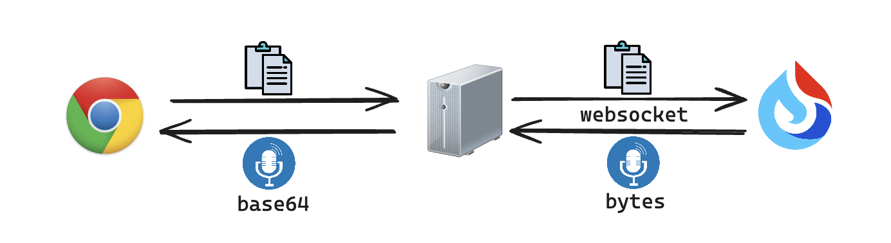

# TTS性能优化技术
> TTS，英语全称 Text-to-Speech，中文就是“文字转语音”

TTS的实现直接使用 WebAPI 就能够实现。但存在一些问题：
- 不同的操作系统转换出来的音效不同
- 无法定制化语音效果
- 有一定的兼容性问题

第三方平台

存在一些待解决的问题：
- 大文本的转换非常耗时
- 大文本转换出来的音频也很大，也存在传输耗时的问题
- 如何给文本添加情绪

**解决思路**
- 将大文本进行分割，拆解成小文本。
- 添加情绪需要用到一些自然语言处理库
- 对转换过了的文本进行缓存

1. 文本断句：文本断句的时候需要考虑到文本切割的一个粒度, 以标点符号来断句
```js
function splitTextByPunctuation(text) {
  // 使用正则表达式匹配句子结束的标点符号
  return text.match(/[^。！？]*[。！？]/g) || [];
}

// 示例文本
const longText = "这是第一句话。这里是第二句话，包含更多的内容。还有一些问句吗？当然有！这是最后一句。";

// 使用标点符号进行断句
const sentences = splitTextByPunctuation(longText);
console.log(sentences);
```
2. 情绪标记, 这里需要借助一些自然语言处理库, 如果需要，可能需要额外的服务进行处理
3. 并发的控制，因为大文本被拆成了小文本，文本内容减少了，但是文本的量增多了。
   1. 限制并发的数量
   2. 使用队列来管理请求
   3. 动态的去调整并发的数量
   4. 请求的取消
   5. 转换base64：前端服务器拿到 bytes 数据后，可以进行一层转换，将其转换为 base64 格式的数据，这样客户端的页面上使用的时候就会更加方便，可以给生成的 audio 元素的 src 属性直接赋值这个 base64
   6. 进行缓存
      1. 缓存在客户端的好处在于获取缓存的速度很快，可以采用 localstorage 来存，值存对应的 base64 数据，键则是对应的文本内容。不过这里有个细节的点要考虑，就是键如果直接用文本的话，可能一句话过长，导致键超出 localstorage 的长度限制，所以需要做一层 MD5 处理。本来都打算这么做了，后来我想了一下，客户端的缓存只能存当前用户转换过的文本，但是一般来讲，用户看完某篇知识文档后，转而就会去看下一篇，不太会一篇文档翻来复去听个十来遍，除非是一篇超高质量、需要反复玩味的文档。

> 我看到你的项目亮点里面写的是“优化 TTS 服务性能问题”，你能详细说一下这是啥么？然后讲一下有什么样的性能问题么？并且你这边具体是如何进行优化的？


将TTS相关的逻辑操作封装成一个useTTS
- 传入参数为要使用的tts服务, 方便开发时用浏览器的api，灰度或线上再用后端接口
- 返回一个speaker，接口模式，
  - 实现speak\pause\resume\cancel等功能
  - 注册回调函数，onend: 没读完一句话触发