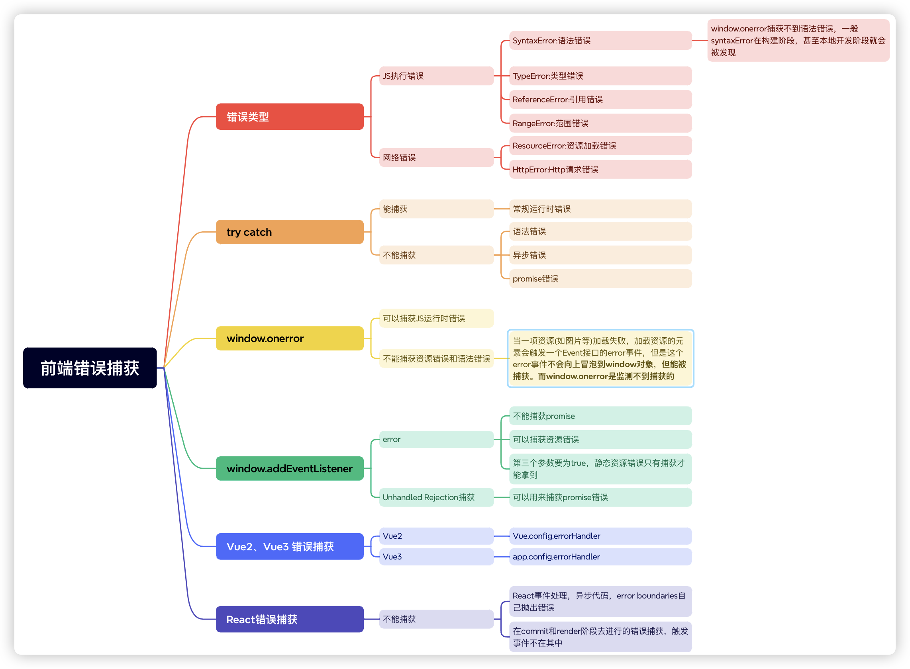

# 前端埋点监控

运营与产品团队需要关注用户在产品内的行为记录，通过用户的行为记录来优化产品。

研发与测试团队则需要关注产品的性能以及异常，确保产品的性能体验以及安全迭代。

我们就需要在用户端进行监测，当然主要目的是为了让我们的产品更完善，更符合我们和用户的需求


[//]: # (Nyar.js 得名于奈亚拉托提普&#40;Nyarlathotep, 伏行之混沌&#41;，潜藏于诸多项目之中，是xrepo监管诸多项目的代行者)

完整的数据监控平台至少分为三部分：
- 数据采集与上报：一般情况下，数据的采集与上报，我们都会做成单独的SDK，产品直接引用就可以了，一般做以下事情
  - 页面的性能情况：包括各阶段加载耗时，一些关键性的用户体验指标等
  - 用户的行为情况：包括PV、UV、访问来路，路由跳转等
  - 接口的调用情况：通过http访问的外部接口的成功率、耗时情况等
  - 页面的稳定情况：各种前端异常等
  - 数据上报：如何将监控捕获到的数据上报
- 数据整理和存储(后端数据中心)
- 数据展示(表格，图表等分析数据展示)

前端埋点还分为手动埋点和无痕埋点
- **手动埋点**，就是在要监听的项目中的某段代码或者某个事件中加入一段监听SDK代码，然后对监听的内容进行上报，好处就是可以对关键性行为做出具体的跟踪，坏处是具有侵入性
- **无痕埋点**，就是就是对监听的项目进行全部无脑监听，比如点击事件，滚动事件等等，只要触发了就上报。好处就是对代码没有侵入性，坏处当然也很明显无法快速定位关键信息，上报次数多，服务器压力大

## 错误监控



## 数据上报

1. ajax

ajax上报这种方式存在很大的问题。
- **浏览器的安全策略：**由于浏览器的安全策略，Ajax 请求可能会受到同源策略限制。
- **页面卸载时的数据上报：**如果使用异步的 XMLHttpRequest 或 fetch 发送 Ajax 请求进行数据上报，由于这些请求是异步的，可能会导致在页面卸载时尚未完成请求，从而导致数据丢失。当然，我们可以使用同步的 XMLHttpRequest来简单解决这个问题
- **阻塞页面卸载：**如果在页面卸载时，当前页面仍在发送 Ajax 请求，这些请求可能会阻塞页面的卸载，导致页面无法正常关闭，从而影响用户体验。

2. Navigator.sendBeacon

navigator.sendBeacon()方法可用于通过 HTTP POST 将少量数据 异步 传输到 Web 服务器。

它主要用于将统计数据发送到 Web 服务器，同时避免了用传统技术（如：XMLHttpRequest）发送分析数据的一些问题。

使用 sendBeacon() 方法会使用户代理在有机会时异步地向服务器发送数据，同时不会延迟页面的卸载或影响下一导航的载入性能，这意味着：
- 数据发送是可靠的。
- 数据异步传输。
- 不影响下一导航的载入。

3. 图片打点上报的方式

其实除了传统的ajax方式，以及Navigator.sendBeacon()方式，还可以采用图片打点上报的方式。

这种方式可以避免页面切换阻塞的问题，但是缺点也很明显：
- 由于是url地址传值，所以传值的数据长度有限
- 地址传递需要后端单独做处理

> 延迟上报：如果大量的问题需要上传，比如用户疯狂点击出现错误情况，那么每次上报这种情况也不太好，因此做一下延迟上报处理，也很有必要

## 页面性能监控
> 前端性能监控，就是要监测页面的性能情况，将各种的性能数据指标量化并收集
- Lighthouse 是一个网站性能测评工具，在高版本（ >= 60）的 Chrome 浏览器中，Lighthouse 已经直接集成到了调试工具 DevTools中, 能够生成一份该网站的报告
- Performance选项
- Navigation Timing API，实现了自动、精准的页面性能打点；开发者可以通过 **window.performance** 属性获取
  - PerformanceObserver 用于监测性能度量事件，在浏览器的性能时间轴记录新的 performance entry 的时候将会被通知

```js
new PerformanceObserver((entryList) => {
  for (const entry of entryList.getEntriesByName('first-contentful-paint')) {
    console.log('FCP candidate:', entry.startTime, entry);
  }
}).observe({type: 'paint', buffered: true});
```
- **web-vitals 以用户为中心的性能指标**: google发布了web-vitals ，它是一个开源的用以衡量性能和用户体验的工具，对于我们现在来说，这个开源工具中所提到的指标已经足够用了。而且现在本身也是**业界标准**

用户体验可以体现在这三个方面：
- 加载速度 决定了 用户是否可以尽早感受到页面已经加载完成
- 视觉稳定 衡量了 页面上的视觉变化对用户造成的负面影响大小
- 交互延迟 决定了 用户是否可以尽早感受到页面已经可以操作

1. `FCP (First Contentful Paint)`: 首次内容绘制

首次内容绘制 (FCP) 指标测量页面从开始加载到页面内容的任何部分在屏幕上完成渲染的时间。对于该指标，"内容"指的是文本、图像（包括背景图像）、<svg>元素或非白色的<canvas>元素。

2. `LCP (Largest Contentful Paint)`: 最大内容绘制

最大内容绘制 (LCP, Largest Contentful Paint) 指标会根据页面首次开始加载的时间点来报告可视区域内可见的最大图像或文本块完成渲染的相对时间。

3. `CLS`: 累计布局偏移

累计布局位移，CLS会测量在页面整个生命周期中发生的每个意外的布局移位的所有单独布局移位分数的总和，他是一种保证页面的视觉稳定性从而提升用户体验的指标方案。

用人话来说就是当点击页面中的某个元素的时候，突然布局变了，手指点到了其它位置。比如想点击页面的链接，突然出现了一个banner。这种情况可能是因为尺寸未知的图像或者视频。

4. `FID (First Input Delay)` 首次输入延迟

从用户第一次与页面进行交互到浏览器实际能够响应该交互的时间，输入延迟是因为浏览器的主线程正忙于做其他事情，所以不能响应用户，发生这种情况的一个常见原因是浏览器正忙于解析和执行应用程序加载的大量计算的JavaScript。

5. `TTI (Time to Interactive)`

网页第一次完全达到可交互状态的时间点，浏览器已经可以持续的响应用户的输入，完全达到可交互的状态的时间是在最后一个长任务完成的时间，并且在随后的5s内网络和主线程是空闲的。

6. `TBT (Total Block Time)`

总阻塞时间，度量了FCP和TTI之间的总时间，在该时间范围内，主线程被阻塞足够长的时间以防止输入响应。只要存在长任务，该主线程就会被视为阻塞，该任务在主线程上运行超过50毫秒。

## 用户行为监控
**用户关键行为相关的埋点类型：**
- 页面埋点：统计用户进入或离开页面的各种维度信息，如页面浏览次数（PV）、页面停留时间、路由切换等。
- 事件埋点：统计用户在应用内的每一次点击事件，如新闻的浏览次数、文件下载的次数、推荐商品的命中次数等
- 曝光埋点：统计具体区域是否被用户浏览到，如活动的引流入口的显示、投放广告的显示等。

### PV、UV
PV(page view) 是页面浏览量，UV(Unique visitor)用户访问量。PV 只要访问一次页面就算一次，UV 同一天内多次访问只算一次。

对于前端来说，只要每次进入页面上报一次 PV 就行，UV 的统计可以放在服务端来做

### 页面停留时长
用户进入页面记录一个初始时间，用户离开页面时用当前时间减去初始时间，就是用户停留时长。这个计算逻辑可以放在 beforeunload 事件里做。

- 页面跳转
利用 addEventListener() 监听 popstate、hashchange 页面跳转事件。需要注意的是调用history.pushState()或history.replaceState()不会触发popstate事件。只有在做出浏览器动作时，才会触发该事件，如用户点击浏览器的回退按钮（或者在Javascript代码中调用history.back()或者history.forward()方法）。同理，hashchange 也一样。

- Vue 路由变更, Vue 可以利用 router.beforeEach 钩子进行路由变更的监听。

### 页面重要区域监控
这个一般都需要进行手动埋点了，具体的页面进行监控，常常会用到Web API 的几个Observer，MutationObserver，IntersectionObserver，ResizeObserver

## 错误还原

这个一般都是通过sourcemap还原与前端录屏来实现

我们的项目想要部署上线，就需要将项目源码经过混淆、压缩、babel编译转化等等的操作之后，生成最终的打包产物，再进行线上部署；而这样混淆后的代码，我们基本上无法阅读，即使在上文的错误监控里，我们获取了报错代码的行号、列号等关键信息，我们也无法找到具体的源码位置所在；这个时候就需要 Sourcemap

Sourcemap 本质上是一个信息文件，里面储存着代码转换前后的对应位置信息。它记录了转换压缩后的代码所对应的转换前的源代码位置，是源代码和生产代码的映射，一般我们通过打包工具，进行配置之后，就能得到相应的.map文件。

当然，.map文件肯定不能部署到线上地址，一般比较简单的做法是在专门的监控平台手动上传到监控平台的形式去进行错误的分析定位

[前端录屏](https://juejin.cn/post/7137949253493587975)的实现方式有很多，这里介绍的是`rrweb`

rrweb全称 'record and replay the web'，是当下很流行的一个录制屏幕的开源库。与我们传统认知的录屏方式（如 WebRTC）不同的是，rrweb 录制的不是真正的视频流，而是一个记录页面 DOM 变化的 JSON 数组，因此不能录制整个显示器的屏幕，只能录制浏览器的一个页签。

## 监控告警
- 宏观告警 更加关注的是：一段时间区间内，新增异常的数量、比率是否超过了阈值；如果超过了那就进行告警；
- 微观告警 更加关注的是：是否有新增的、且未解决的异常；

整体来说，无论宏观还是微观告警，前端不需要做太多处理。异常信息发送的后端之后，通过后端验证。如果是宏观告警，后端会进行告警收集，超过阈值进行告警。

如果是微观告警，异常信息发送的后端之后，通过后端验证是否是新的异常，只要出现的新异常，它的 uid 是当前已激活的异常中全新的一个；那么后端就进行告警。