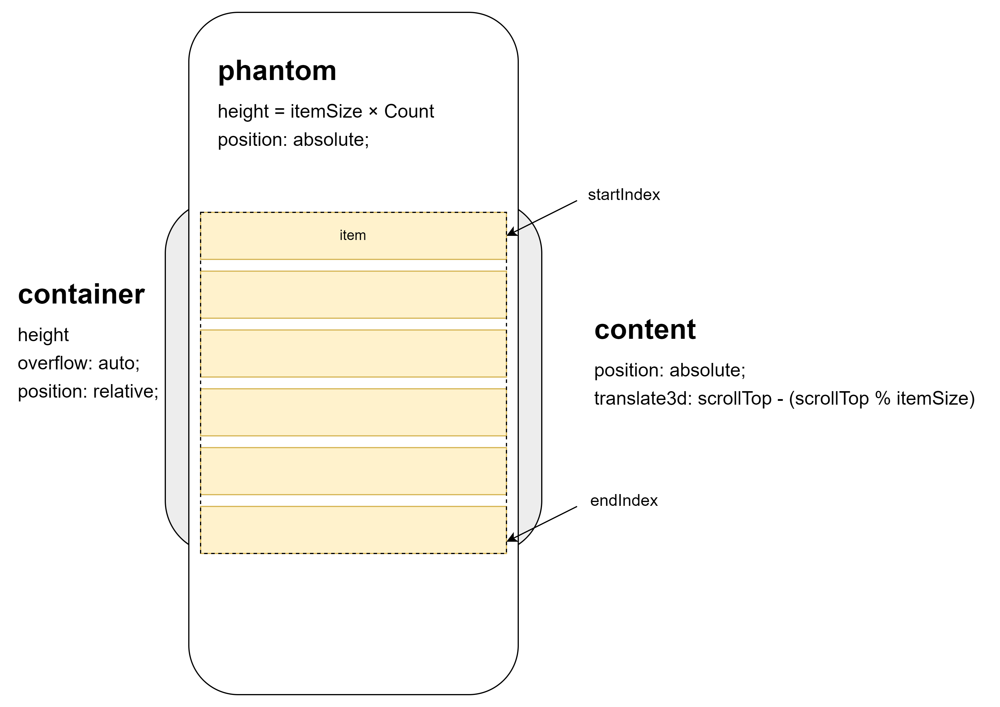

# 虚拟列表
> 面试题：一次性给你 10000 条数据，前端怎么渲染到页面上？
> 懒加载、分时函数、虚拟列表, 无论是懒加载还是时间分片，最终都是将完整数量的列表项渲染出来，这在面对列表项非常非常多的时候，页面性能是比较低的

虚拟列表是按需显示的一种技术，可以根据用户的滚动，不必渲染所有列表项，而只是渲染可视区域内的一部分列表元素的技术, 本质上是**动态修改可视区域里面的内容**

## 每项固定高度的虚拟列表

<preview codePath="knowledge-lib/js/场景应用/虚拟列表/fixed.vue">
  <fixed-list />
</preview>

## 动态高度的虚拟列表

- 如何获取真实高度？

在实际渲染之前是很难拿到每一项的真实高度的，所以我们采用预估一个高度渲染出真实 DOM，再根据 DOM 的实际情况去更新真实高度。
> 当数量不是非常非常大时，可以考虑利用浏览器的先计算布局，然后在渲染的机制。向content插入所有数据节点，立即读取浏览器计算出的布局大小，然后在渲染前移除所有节点，可以得到相对准确的高度。(参考源码目录下：vscroll-scroll-itemHeight-random.html)

> 这里存在一个问题，如果元素内有不定大小的元素，如图片，那么就不应该在“渲染后”立即更新缓存列表，而是在通过ResizeObserver监听元素的变化，然后更新缓存列表

创建一个缓存列表，其中列表项字段为 索引、高度与定位，并预估列表项高度用于初始化缓存列表。在渲染后根据 DOM 实际情况更新缓存列表。

- 相关的属性该如何计算？

根据缓存列表重写计算属性、滚动回调函数，例如列表总高度的计算可以使用缓存列表最后一项的定位字段的值。

- 列表渲染的项目有何改变？

因为用于渲染页面元素的数据是根据 开始/结束索引 在 数据列表 中筛选出来的，所以只要保证索引的正确计算，那么渲染方式是无需变化的。

对于开始索引，我们将原先的计算公式改为：在 缓存列表 中搜索第一个底部定位大于 列表垂直偏移量 的项并返回它的索引
对于结束索引，它是根据开始索引生成的，无需修改。

<preview codePath="knowledge-lib/js/场景应用/虚拟列表/dynamic.vue">
  <dynamic-list />
</preview>

## 其它优化

> 白屏闪烁问题

此时如果用户滚动过快，会出现白屏闪烁的现象

在原先列表结构的基础上加上缓冲区，也就是整个渲染区域由 可视区 + 缓冲区 共同组成，这样就给滚动回调和页面渲染留出了更多的时间

> 滚动事件触发频率过高
- debounce防抖
- 使用 IntersectionObserver 来替换监听 scroll 事件。相比 scroll，IntersectionObserver 可以设置多个阈值来检测元素进入视口的不同程度，只在必要时才进行计算，没有性能上的浪费。并且监听回调也是异步触发的。
  - 这个方案不行：
    - 必须要有缓冲区，不然初次渲染后很可能出现后续元素触发entersection
    - 快速滚动，使用scrollbar跳转也会出问题