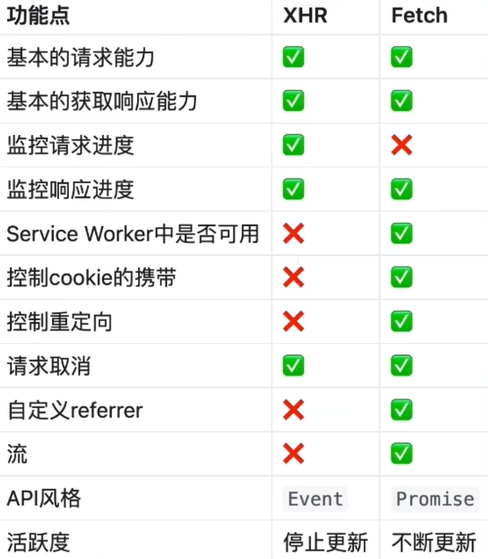

# axios



## 进度监控

`xhr.progress`事件

```js
xhr.addEventListener('process', (e) => {
    console.log(e.loaded / e.total);
});
xhr.upload.addEventListener('progress')
```

fetch

总数据量：响应头`Content-length`
resp.body.getReader 读取返回的流
累加reader.read()读取的数据量，然后计算百分比，更新到进度条上

```js
const resp = await fetch(url);
const total = resp.headers.get('content-length');
const decoder = new TextDecoder();
let body=''
const reader = resp.body.getReader();
let loaded = 0;
while(1) {
    const { value, done } = await reader.read();
    if (done) break;
    body += decoder.decode(value);
    loaded += value.length;
    console.log(loaded / total);
}
```

正确做法应该是重新创建一个readable stream，劫持response，用新的readable stream填充，因为你不能代替用户把stream读了，而是应该在用户读stream的时候计算进度，这不是一样的概念

