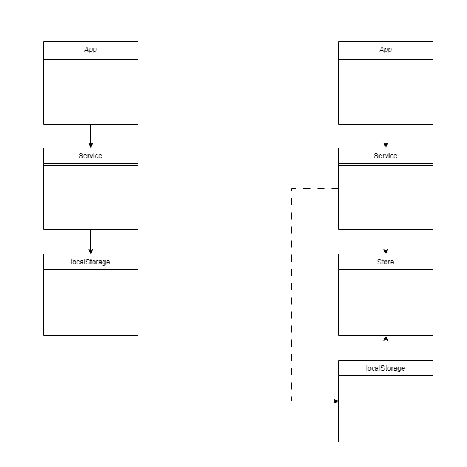

# 设计模式

https://cloud.tencent.com/developer/user/7565276/articles  7

## 单一职责原则
> Single Responsibility Principle，简称是SRP

Single Responsibility Principle，简称是SRP
不要存在多于一个导致类变更的原因。该原则备受争议，争议之处在于对职责的定义，什么是类的职责?怎么划分类的职责?

## 里氏替换原则
> Functions that use pointers or references to base classes must be able to use objects of derived classes without knowing it.

如果对每一个类型为S的对象o1，都有类型为T的对象o2，使得以T定义的所有程序P在所有的对象o1都代换成o2时，程序P的行为没有发生变 化，那么类型S是类型T的子类型。
在面向对象的语言里，继承无疑是一个优秀的特性，它有提高代码复用性、扩展性等优点，但是白璧微瑕，它同样也会带来一些不足：
- 继承是侵入性的。只要继承，就必须拥有父类的所有属性和方法；
- 降低了代码的灵活性。子类必须拥有父类的属性和方法，让子类自由的世界中多了些约 束；
- 增强了耦合性。当父类的常量、变量和方法被修改时，需要考虑子类的修改，而且在缺乏规范的环境下，这种修改可能带来非常糟糕的结果——大段的代码需要重构。
为了扬长避短，就有必要引入里氏替换原则。

## 依赖倒置原则
> High level modules should not depend upon low level modules. Both should depend upon abstractions. Abstractions should not depend upon details. Details should depend upon abstractions

- 高层模块不应该依赖低层模块，两者都应该依赖其抽象；
- 抽象不应该依赖细节；
- 细节应该依赖抽象。



## 单例模式
定义：全局唯一访问对象，像是浏览器中的window
应用场景：缓存，全局状态管理

下面是实现一个全局唯一的请求实例Request，在使用时先获取这个唯一实例然后调用方法即可，这样实现的请求实例是全局唯一的

**static**是类中的标识，其标记的参数和函数被称作静态参数或函数，它往往用来实现通用应用，不应该被某个实例调用，应该使用类直接使用`Request.getInstance`
```js
export class Request {
	static instance;  // 全局唯一实例

	// 获取全局唯一实例
	static getInstance() {
            if (this.instance) {
                    return this.instance;
            }
            this.instance = new Request();
            return this.instance;
	}

	async request(url) {
            // 发送请求...
	}
}

// 使用方法
const request = Request.getInstance();
await request.request("/api/1");

```
## 发布订阅模式
定义：一种订阅机制，可在被订阅对象发生变化时通知订阅者
应用场景：从系统架构之间的解耦，到业务中一些实现模式，像邮件订阅，上线订阅等等，应用广泛

**fllowers**是一个数组用来存储订阅了该user的其它user

**online**在该user上线时，它会遍历flowers，调用订阅者的通知函数


```js
class User {
    constructor(name) {
        this.name = name;
        this.status = "offline";
        this.followers = [];
    }

    subscribe(user, notify) {
        user.followers.push({ user, notify });
    }

    online() {
        this.status = "online";
        console.log(this.name + " 上线");

        this.followers.forEach(({ notify }) => {
                notify(this);
        });
    }
}

const user1 = new User("user1");
const user2 = new User("user2");
const user3 = new User("user3");

user1.subscribe(user3, () => {
	console.log("user1 收到");
});
user2.subscribe(user3, () => {
	console.log("user2 收到");
});

user3.online();
// user3 上线
// user1 收到
// user2 收到

```

## 工厂模式 

https://juejin.cn/post/6844903653774458888

## 外观模式

当我们提出一个门面，我们要向这个世界展现的是一个外观，这一外观可能藏匿着一种非常与众不同的真实。这就是我们即将要回顾的模式背后的灵感——门面模式。这一模式提供了面向一种更大型的代码体提供了一个的更高级别的舒适的接口，隐藏了其真正的潜在复杂性。把这一模式想象成要是呈现给开发者简化的API，一些总是会提升使用性能的东西。

门面是一种经常可以在Javascript库中看到的结构性模式，像在jQuery中，尽管一种实现可能支持带有广泛行为的方法，但仅仅只有这些方法的“门面”或者说被限制住的抽象才会公开展现出来供人们所使用。

为了在我们所学的基础上进行构建，门面模式同时需要简化一个类的接口，和把类同使用它的代码解耦。这给予了我们使用一种方式直接同子系统交互的能力，这一方式有时候会比直接访问子系统更加不容易出错。门面的优势包括易用，还有常常实现起这个模式来只是一小段路，不费力。

## JS中的设计模式
### 原型模式
定义：复制已有对象来创建新的对象
应用场景：js中对象创建的基本模式

根据这个示例，baseUser就像是一个基线，createUser中主要是利用Object.create拷贝了一份baseUser然后进行个性化的设置
```js
const baseUser = {
    name: "",
    status: "offline",
    followers: [],

    subscribe(user, notify) {
        user.followers.push({ user, notify });
    },

    online() {
        (this.status = "online"),
        this.followers.forEach(({ notify }) => {
                notify(this);
        });
    },
};

export const createUser = (name) => {
    const user = Object.create(baseUser);

    user.name = name;
    user.followers = [];

    return user;
};
```
### 代理模式
定义：可自定义对原对象的访问方式，并且允许在更新前后做一些额外处理
应用场景：监控，代理工具，前端框架的实现

这个实例中使用proxy来实现了类似于发布订阅者模式的功能，当user的属性更改时，如果发生了status状态变化，就会去通知订阅者执行notify函数
```js
class User {
	constructor(name) {
		this.name = name;
		this.status = "offline";
		this.followers = [];
	}

	subscribe(user, notify) {
		user.followers.push({ user, notify });
	}

	online() {
		this.status = "online";
	}
}

export const createProxyUser = (name) => {
    const user = new User(name);

    const proxyUser = new Proxy(user, {
        set: (target, prop, value) => {
            target[prop] = value;
            if (prop === "status") {
                notifyStatusHandlers();
            }
        },
    });

    const notifyStatusHandlers = (user, status) => {
        if (status === "online") {
            user.followers.forEach(({ notify }) => {
                notify(user);
            });
        }
    };

    return proxyUser;
};
```
### 迭代器模式
定义：在不暴露数据类型的情况下访问集合中的数据
应用场景：数据结构中有多种数据类型，列表，树等，提供通用操作接口

`for of`


